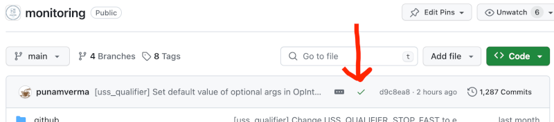
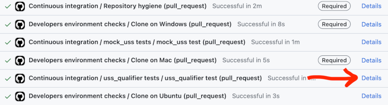
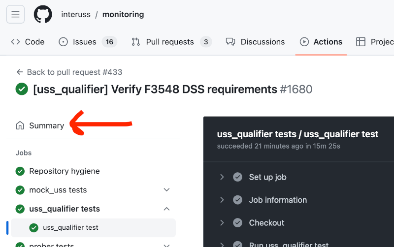
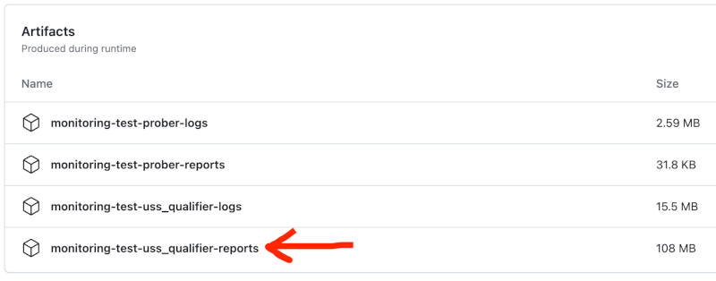

# [Continuous integration](ci.yml)

## Overview

Before a pull request can be merged into the main branch, it must pass all automated tests for the repository.  This document describes the tests and how to run them locally.

To run the equivalent of the full CI suite locally, simply execute `make presubmit`.  This should perform all of the steps below, including bringing up a local interoperability ecosystem and all local USS mocks necessary to conduct tests.  Therefore, `make presubmit` can (and should) be run starting without any pre-existing local infrastructure (interoperability ecosystem and/or USS mocks).

The downside of `make presubmit` is that it takes a long time, and a lot of that time is spent bringing up and tearing down local infrastructure (interoperability ecosystem and USS mocks).  If your changes do not affect one or both of these things, you may save substantial time by bringing up an interoperability ecosystem once and leaving it up while developing, and possibly bringing up a set of USS mocks ([mock_uss](../../monitoring/mock_uss) instances) and leaving them up while developing (though obviously this will not work if developing changes that affect mock_uss).  See uss_qualifier tests section below.

## Checks

### Repository hygiene (`make check-hygiene`)

This set of tests including  [miscellaneous hygiene checks](../../test/repo_hygiene/README.md) ensures consistent formatting and performs other hygiene-related tasks that are not usually related to the actual functionality of the repository.

#### Python lint (`make python-lint`)

To maintain consistency across this large codebase, InterUSS employs a very strict Python linter.  But, there is no need to satisfy the linter manually; simply run `make format` from the repo root to resolve most mere-formatting issues that this check will detect.

#### uss_qualifier documentation validation (`make validate-uss-qualifier-docs`)

uss_qualifier [scenario documentation](../../monitoring/uss_qualifier/scenarios/README.md#documentation) is required and has strict requirements to ensure a strong, consistent, and correct interface between regulators and others concerned only with the concept of what scenarios are doing, and InterUSS contributors concerned with writing the actual code to perform the test.  This check validates many of these documentation requirements.

#### Shell lint (`make shell-lint`)

This repository contains a large number of shell scripts.  This check attempts to have these scripts follow best practices and avoid common pitfalls.

### mock_uss tests (`make test` in monitoring/mock_uss)

This check runs unit tests for mock_uss.

### uss_qualifier tests (`make test` in monitoring/uss_qualifier)

Note: setting configuration `stop_fast` to `true` is recommended as setting that flag in configuration will cause testing to stop on the first failure, and this is usually the desired behavior when debugging.

This action:

* Brings up a local interoperability ecosystem
* Brings up local USS mocks
* Runs monitoring/uss_qualifier/run_locally.sh
* Tears down local USS mocks
* Tears down local interoperability ecosystem

When debugging, changes very rarely change the behavior of the local interoperability ecosystem.  So, it is usually faster to leave a single local interoperability ecosystem up for the entire debugging session.  A local interoperability ecosystem can be brought up with `make start-locally` from the repo root, and torn down with `make down-locally` from the repo root.

When only making changes to uss_qualifier and not making changes that affect mock_uss, it is usually faster to leave the set of USS mocks running throughout a debugging session.  The USS mocks can be brought up with `make start-uss-mocks` from the repo root, and torn down with `make stop-uss-mocks`.

uss_qualifier's run_locally.sh ([monitoring/uss_qualifier/run_locally.sh](../../monitoring/uss_qualifier/run_locally.sh)) executes uss_qualifier in docker container connected to the local networks established by the local interoperability ecosystem and local USS mocks.  It accepts an optional parameter specifying the test configuration to run.  If this parameter is omitted (as it is in the CI test), all tracked configurations will be run (see run_locally.sh for a list).  To speed up debugging, run just the configuration producing the error by [specifying it](../../monitoring/uss_qualifier/configurations/README.md#specifying); e.g., `monitoring/uss_qualifier/run_locally.sh configurations.dev.uspace`.

### prober tests (`make test` in monitoring/prober)

[prober](../../monitoring/prober/README.md) is a legacy test suite dedicated to integration testing of DSS instances.  It is being migrated to test scenarios and suites in uss_qualifier, but in the meantime, it is still the standard way to validate DSS functionality.  It runs on the DSS provided as part of the local interoperability ecosystem.

## Troubleshooting

Whenever CI is run on GitHub, a large amount of documentation on that test run is generated.  Each of the checks is documented separately.  When CI is run upon merging a PR to the main branch, the list of checks is accessible by clicking on the green checkmark (or red x) near the top of [the repo homepage](https://github.com/interuss/monitoring):

When CI is run for a PR, the list of checks is visible near the bottom of the PR page.  If all checks passed, the list of checks must be opened by clicking "Show all checks".

In either case, the details of a particular check can be viewed by clicking on the "Details" link to the right of the check name:

This GitHub Actions job run page shows the console output from the job.  If there was an exception during the run, the error message of interest will usually be near the end of the last console output for the job.

### uss_qualifier artifacts

Some of the most useful outputs of uss_qualifier are the artifacts generated from the uss_qualifier test runs that are part of the CI.  When a PR is merged to the main branch of the repository, some of these artifacts are published to [https://interuss.github.io/monitoring](https://interuss.github.io/monitoring/).  These artifacts (and some additional ones) are available for every CI run.  To access them from a GitHub Actions job run page (see just above), first click "Summary" for the run:

Then, scroll down to the bottom of the page to see the list of GitHub Actions artifacts.  The GitHub Actions artifact that contains the uss_qualifier artifacts from all uss_qualifier test runs during the CI is the one labeled "monitoring-test-uss_qualifier-reports":

Click on this artifact to download a zip file which can then be unzipped to reveal a uss_qualifier/output folder structure.  Each subfolder in uss_qualifier/output contains the output of a particular test run of uss_qualifier -- for instance, the `f3548` folder contains the output from running the [`configurations.dev.f3548_self_contained` configuration](../../monitoring/uss_qualifier/configurations/dev/f3548_self_contained.yaml).  The sequence view artifact is often particularly useful for debugging.

### Automated testing logs

The logs from all of the containers running during uss_qualifier automated tests (DSS instance, mock_uss instances, etc) can be found in the GitHub Actions artifact labeled "monitoring-test-uss_qualifier-logs"; see above for download instructions.
