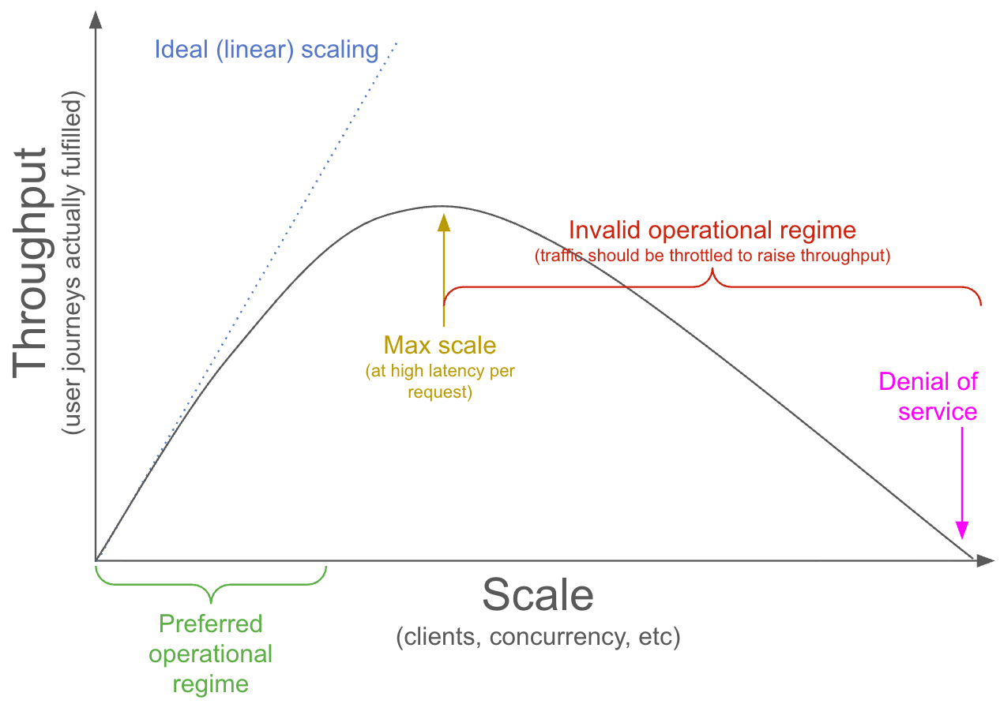

# LoadTest tool

## Introduction
The LoadTest tool is based on [Locust](https://docs.locust.io/en/stable/index.html) which provides a UI for controlling the number of Users to spawn and make random requests.

## General usage guidance

Most systems roughly follow the Universal Scalability Law[1](https://www.graphiumlabs.com/blog/part2-gunthers-universal-scalability-law),[2](https://raw.githubusercontent.com/VividCortex/ebooks/master/scalability.pdf) model that includes three effects:

1. At low load, each additional unit of load is handled with the same efficiency.  So, achieved throughput scales linearly with load.  Achieved throughput is successful operations per time.
2. But, there are likely some shared resources and higher loads increase contention for those shared resources.  This causes throughput to fall away from linear scaling toward an asymptotic maximum throughput.
3. Even worse, maintaining coherence between processing units may require crosstalk which is a cost that scales with load.  The marginal throughput from additional load falls to zero due to effect 2 above (contention), but then this additional coherency penalty means that throughput eventually decreases with increasing load.

Combining the three effects above means that the graph of throughput versus load usually looks qualitatively similar to this:

The max throughput point shown above is an extremely important point. The system should never be operated in the operational regime to the right of the max throughput point. Any performance metrics captured in the regime to the right of this max throughput point are invalid as they could be improved almost for free with load shedding.

Even the max throughput point is not one we want to reach because requests at that point will be served with very high latency compared to requests served at lower load/throughput. Instead, this max throughput point should be the absolute maximum load the system should see when working through a burst of load.

Therefore, load tests should be conducted such that metrics are reported from the left side of this curve.  If DSS latency is consistenly above ~6 seconds, it is very likely the load applied is on the right (wrong) side of the curve above.  When DSS latency averages near 10 seconds (the operation-abort timeout threshold), it is almost certain the applied load is on the right (wrong) side of the curve.

The following techniques may be helpful to ensure valid metrics are measured from the left side of the curve:

1. Consider stepping up the load in small steps, verifying latency hasn't spiked for each step (when latency spikes, determine whether that is because the right side of the curve has been reached) and that throughput (successful operations per time) has not started to decrease appreciably.
2. Consider drawing the entire left side of the performance curve by applying a load, allowing behavior to stabilize, measuring throughput, recording the (load, throughput) scatter point, marginally increasing the load, and repeating until the curve is sufficiently complete to characterize the behavior of the system in the load regimes of interest.
3. If latency is high, do not quote metrics at that load until verifying that marginally reducing load does not increase throughput (if it does, continue reducing load until reaching the left side of the curve).
4. Ensure useful throughput is being measured (successful operations per time) rather than total throughput (total operations per time, including failed operations).

## Available tests

### ISA.py

Create ISA on RID endpoints.

Currently its configured to make the request in the ratio 10 x Create ISA : 5 x Update ISA : 100 x Get ISA : 1 x Delete ISA. This means the User is 10 times likely to Create an ISA vs Deleting an ISA, and 10 times more likely to Get ISA vs Creating an ISA and so on.

Parameters:

* `--uss-base-url`: Base URL of the USS, used to create ISAs.

### Sub.py

Create subscriptions on RID endpoints.

Subscription workflow is heavier on the Write side with the ratio of 100 x Create Sub : 50 x Update Sub : 20 x Get Sub : 5 x Delete Sub.

Parameters:

* `--uss-base-url`: Base URL of the USS, used to create subscriptions.

### SCD.py

Create operational intents on SCD endpoints.

Flights will be created based on parameters.

Parameters:

* `--uss-base-url`: Base URL of the USS, used to create subscriptions.
* `--area-lat`: Latitude of the center of the area in which to create flights
* `--area-lng`: Longitude of the center of the area in which to create flights
* `--area-radius`: Radius (in meters) of the area in which to create flights
* `--area-lat`: Maximum distance to cover for an individual flight
* `--oi-duration`: Duration (in seconds) of the operational intent

### FlightsInSub.py

Create subscriptions on N circular areas and then create operational intents in thoses subscriptions using SCD endpoints.

Flights and subscriptions will be created based on parameters.
Clusters are shifted by approimatly 2*Radius on the latitude axe.

First, all N subscriptions are created. Then, each user randomly picks one of those N areas
and creates a random flight path within the circle.

Parameters:

* `--uss-base-url`: Base URL of the USS, used to create subscriptions.
* `--cluster-count`: Number of clusters to create
* `--base-lat`: Latitude of the center of the first cluster
* `--base-lng`: Longitude of the center of the first cluster
* `--area-radius`: Radius (in meters) of the area in which to create flights
* `--max-flight-distance`: Maximum distance to cover for an individual flight
* `--oi-duration`: Duration (in seconds) of the operational intent

## Adjusting workload ratio
For `ISA.py` and `Sub.py`, every action has a weight declared in the `@task(n)` decorator. You can adjust the value of `n` to suite your needs

## Run locally without Docker
1. Go to the repository's root directory. We have to execute from root directory due to our directory structure choice.
1. Install UV: https://docs.astral.sh/uv/getting-started/installation/
1. Set OAuth Spec with environment variable `AUTH_SPEC`. See [the auth spec documentation](../monitorlib/README.md#Auth_specs)
for the format of these values.  Omitting this step will result in Client Initialization failure.

1. Run the loadtest: `AUTH_SPEC="<auth spec>" uv run locust -f ./monitoring/loadtest/locust_files/<Test.py> -H <DSS Endpoint URL> [Parameters]`

## Running in a Container
Simply build the Docker container with the Dockerfile from the root directory. All the files are added into the container

1. From the root folder of this repository, build the monitoring image with `make image`
1. Run Docker container; in general:: `docker run -e AUTH_SPEC="<auth spec>" -p 8089:8089 interuss/monitoring uv run locust -f loadtest/locust_files/<Test.py> -H <DSS Endpoint URL> [Parameters]`
1. If testing local DSS instance, be sure that the loadtest (monitoring) container has access to the DSS container: `docker run -e AUTH_SPEC="DummyOAuth(http://oauth.authority.localutm:8085/token,uss1)" --network="interop_ecosystem_network" -p 8089:8089 interuss/monitoring uv run locust -f loadtest/locust_files/<Test.py> -H <DSS Endpoint URL> [Parameters]`

## Use
1. Navigate to http://127.0.0.1:8089
1. Start new test with number of Users to spawn and the rate to spawn them.
1. For the Host, provide the DSS root endpoint used for testing. An example of such url is: http://dss.lb.localutm/ in case local environment is setup with `make start-locally`

## Examples to run tests locally

Before running all examples:

* `make image`
* `make start-locally`

### ISA.py

`docker run -e AUTH_SPEC="DummyOAuth(http://oauth.authority.localutm:8085/token,uss1)" --network="interop_ecosystem_network" -p 8089:8089 -v .:/app/ interuss/monitoring-dev uv run locust -f loadtest/locust_files/ISA.py -H http://dss.lb.localutm -u 10 --uss-base-url http://dss.lb.localutm`

### Sub.py

`docker run -e AUTH_SPEC="DummyOAuth(http://oauth.authority.localutm:8085/token,uss1)" --network="interop_ecosystem_network" -p 8089:8089 -v .:/app/ interuss/monitoring-dev uv run locust -f loadtest/locust_files/Sub.py -H http://dss.lb.localutm -u 10 --uss-base-url http://dss.lb.localutm`

### SCD.py

`docker run -e AUTH_SPEC="DummyOAuth(http://oauth.authority.localutm:8085/token,uss1)" --network="interop_ecosystem_network" -p 8089:8089 -v .:/app/ interuss/monitoring-dev uv run locust -f loadtest/locust_files/SCD.py -H http://dss.lb.localutm -u 10 --area-lat -34.93 --area-lng 138.6 --area-radius 1000 --max-flight-distance 12000 --uss-base-url http://dss.lb.localutm`

### FlightsInSub.py

`docker run -e AUTH_SPEC="DummyOAuth(http://oauth.authority.localutm:8085/token,uss1)" --network="interop_ecosystem_network" -p 8089:8089 -v .:/app/ interuss/monitoring-dev uv run locust -f loadtest/locust_files/FlightsInSub.py -H http://dss.lb.localutm -u 10 --cluster-count 3 --base-lat -34.93 --base-lng 138.6 --area-radius 1000 --max-flight-distance 1000 --uss-base-url http://dss.lb.localutm`
