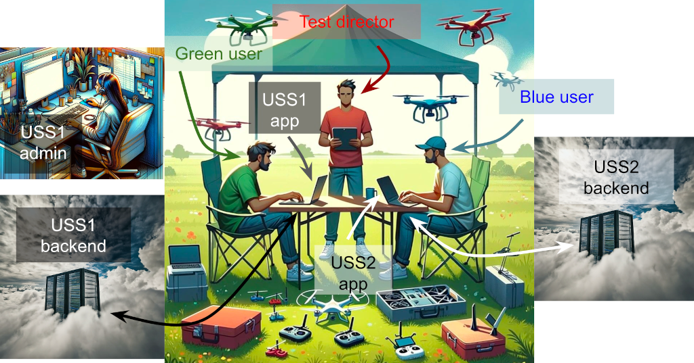

# InterUSS automated testing

[uss_qualifier](./README.md) is InterUSS's tool to perform automated testing in
order to measure compliance of systems under test to requirements. This page
provides an overview of the automated testing philosophy this tool attempts to
implement.

## Manual test equivalence

Automated tests are generally simply automated versions of manual checkouts that
could be conducted by humans. To understand the behavior of an automated test,
one should be able to imagine how a manual checkout would be conducted and apply
that mental model to the automated testing. Similarly and conversely, it should
be possible to manually conduct an InterUSS automated test scenario based solely
on the [test scenario documentation](./scenarios/README.md#documentation) by
simply replacing the [required resources](./scenarios/README.md#resources) with
equivalent manual capabilities.

For instance, if a test scenario needed a way to emulate a USS performing
operations on a DSS instance, the manual test would need to provide a person
equipped with appropriate debug tools and credentials who could manually send
individual queries to a DSS. If a test scenario needed a way to observe the
aircraft shown on a USS's remote identification display, the manual test would
need to provide a person looking at the USS's remote identification display who
would tell the test director what is visible on the display. If a test scenario
needed to perform some administrative tasks on the USS systems under test to
make sure they were ready to conduct the test, a manual test would need to
provide an engineer from each USS who was capable of performing these
administrative tasks.

A potentially-useful visual for a common type of USS testing is shown below.

### Automated testing interfaces

[Automated testing interfaces](https://github.com/interuss/automated_testing_interfaces)
are designed to automate communication and actions that would be made and taken
manually in a manual test. In the visual above for instance, if the test
director would instruct the green user to create a flight during a manual test,
the automated testing interface between the test director and virtual green user
in an automated test should support the ability for the test director to request
creation of a flight. This paradigm is often useful to determine what should and
can be contained in automated testing interfaces. For instance, if the test
director needs to ask the green user about information X related to an attempt
to plan a flight, the automated testing interface must include a field for
information X. Similarly, since the green user does not have access to the USS1
backend except through the USS1 app, the automated testing interface between the
test director and green user cannot expect the green user to report information
contained in the USS1 backend but not presented to the user in the USS1 app.

## Success

### Scope of testing capability

Any kind of testing (automated or manual) to measure compliance to requirements
can never be objectively "complete" because it is impossible to prove a
negative. To say that a system always complies with a requirement is equivalent
to saying that there exists no situation in which the system does not comply
with that requirement. Since all situations cannot be tested, the results of a
test cannot be used to claim that there is no situation in which the system does
not comply. Instead, the results of a test can only be used to show that a
system complied with requirements in all the situations tested. This is
generally considered acceptable in traditional manual tests as long as the test
design had sufficient coverage. There is no standard definition of sufficient
coverage, and its meaning is likely to vary with context. When an important gap
in coverage is identified, both manual and automated tests would generally
respond by adding additional coverage (additional scenarios, steps, etc).
Automated testing generally has the advantage that this additional coverage is
not usually expensive because developing code is relatively easy and conducting
updated automated tests is far easier and faster than conducting manual tests.

When a true, impactful failure to meet requirements is not identified by an
InterUSS test suite designed to measure those requirements, the presumption is
generally that the test suite should be augmented (if practical) to add this
coverage.

### Measurements of success

In general, uss_qualifier is a tool to detect failures to comply with
requirements. Therefore, if a participant has no failures in a test run, the
participant is as compliant as uss_qualifier can detect under the circumstances
tested.

#### Optional/conditional checks

Sets of requirements often allow for a system to do X or Y. If a system complies
with X, then it also complies with "X or Y" even if it does not do Y. Therefore,
in certain cases, a participant may have complete success (no detected failures)
on a test run without performing any of the checks related to Y. If the overseer
of a test wants the test to indicate failure upon not doing Y, the solution is
usually to add a new requirement to do Y and then detect failure with that
requirement if Y was not done. Usually, this additional requirement will not be
part of the original requirement set.

For instance, ASTM F3411 does not require that certain data elements are
transmitted (e.g., operator location), but does require that they follow a
certain format and requirements if transmitted. The FAA's remote identification
regulation requires indication of operator location. Therefore, failure to
transmit operator location is not a failure to comply with any ASTM F3411
requirement, but it is a failure to comply with FAA regulatory requirements.
Therefore, an F3411 test suite would not indicate failure due to missing
operator location (though it may log/note that status/information), but an FAA
Remote Identification test suite (even one using the F3411 test suite to
validate compliance via F3411) would indicate failure due to missing operator
location.

#### Requirement-centric artifacts

One succinct way to define success could be that compliance to a certain minimum
set of requirements was verified for a test participant. A uss_qualifier
artifact that organizes results of a test by participant and requirement
is [tested requirements](./reports/tested_requirements).

## Failure

All tests seek to detect true failures to meet
requirements (["sensitivity"](https://en.wikipedia.org/wiki/Sensitivity_and_specificity))
and avoid indicating failure to meet requirements when the requirements had, in
fact, been
met (["specificity"](https://en.wikipedia.org/wiki/Sensitivity_and_specificity)).
Because automated tests are expected to be treated by regulators as gating items
which disallow participants from doing certain things (such as update their
production systems) upon failure (since "test failure" is presumed to indicate "
failure to meet requirements"), very high specificity is the most important
characteristic of this kind of test: compliant participants should not be
indicated as non-compliant.

### Bar for declaring failure

**If an InterUSS/uss_qualifier [test check](scenarios/README.md#checks) fails,
that should necessarily indicate that one or more participants have failed to
meet one or more requirements.**  If an InterUSS/uss_qualifier test check fails
when the relevant participant(s) have not violated the associated requirement,
that situation is a bug in uss_qualifier and should be fixed.

### Requirements definitions

Because of the criticality of high specificity, clearly identifying the
requirement(s) which have been violated in a failed test check is very
important, and therefore built into the uss_qualifier architecture.
The [`requirements` folder](./requirements) contains definitions or references
to all requirements for which uss_qualifier is capable of measuring compliance.
There are many potential sources of requirements including regulators, standard
development organizations, industry groups, and individuals. The requirements
from all of these sources can potentially be included in the `requirements`
folder, but it is important to correctly identify the source of all
requirements.

For instance, if ASTM F3548-21 were being used to comply with U-space Flight
Authorisation requirements, the U-space Flight Authorisation requirements must
not be labeled as ASTM F3548-21 requirements. If U-space Flight Authorisation
requirements were incorrectly labeled as ASTM F3548-21 requirements, the test
suite dedicated to testing compliance to ASTM F3548-21 would falsely indicate
failure when used in the separate context of measuring compliance to
(hypothetical) United States strategic coordination requirements which also use
ASTM F3548-21 for compliance.

### InterUSS-defined requirements

Because InterUSS is not generally designed to be a standards development
organization, InterUSS automated testing is primarily focused on measuring
compliance to externally-defined requirements. However, like any entity,
InterUSS can establish requirements test participants must meet in order to
accomplish some objective.

#### Compatibility

To maximize compatibility, InterUSS generally attempts to create as few
requirements as practical since each requirement created introduces the
possibility that a participant fully complies with the set of requirements of
interest, but cannot achieve a successful InterUSS test result because they do
not meet the InterUSS requirements that they are otherwise not required to meet.

#### Necessity

InterUSS does need to accomplish its objective of measuring compliance to
requirements, however, and so the creation of some requirements is justified
when necessary to accomplish that objective. For instance, measuring compliance
to flight planning requirements cannot be accomplished if uss_qualifier cannot
cause attempts to plan flights. Therefore, a requirement to implement a flight
planning interface may be a necessary requirement for effective InterUSS testing
of flight planning requirements.
