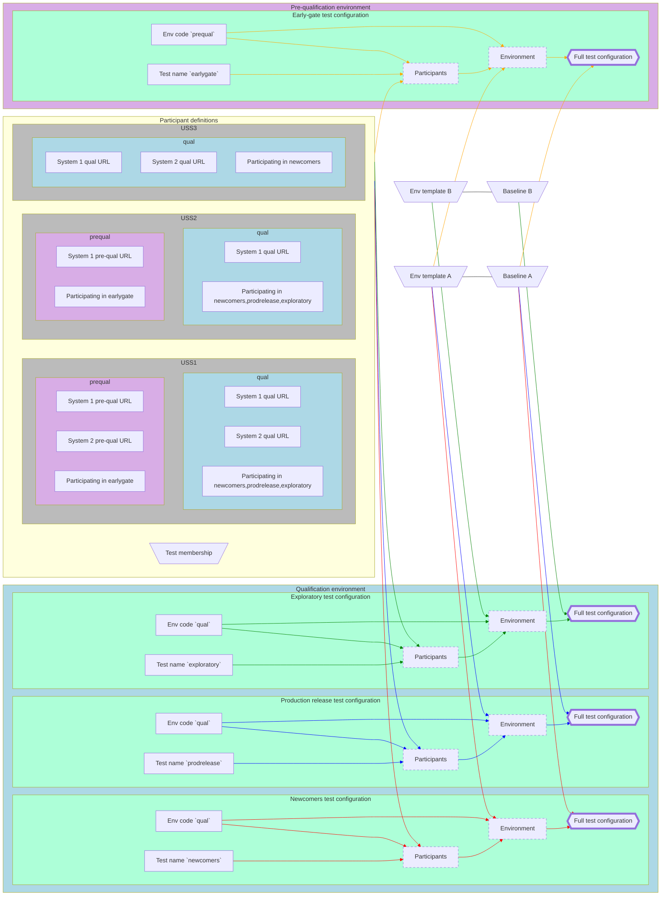

# Configuration design guidelines

## Purpose

This document suggests approaches a test designer may adopt when designing a uss_qualifier automated [test configuration](./README.md) to accomplish various maintainability and scalability goals as described below.

## Strategies

### Define all test configurations using Jsonnet

While test configurations may be defined in any combination of any supported dictionary-like formats such as JSON, YAML, and Jsonnet, [Jsonnet](https://jsonnet.org/) provides a wide array of templating and programmatic tools upon which many other strategies described on this page depend.  By Jsonnet convention, each .jsonnet file is intended to map to one concrete test configuration.  Any number of .libsonnet content fragments can be used by that .jsonnet file (and other .libsonnet files) to construct the concrete test configuration.

Due to its power and flexibility, it can sometimes be difficult to determine the actual test configuration being produced by a Jsonnet configuration.  To address this, each .jsonnet file can be "rendered" into a single flat YAML file which is also version-controlled along with the .jsonnnet and .libsonnet sources.  Changes in the single flat YAML file allow the test designer and any reviewers to more easily understand the ultimate impact of changes to the programmatic Jsonnet configuration while the original Jsonnet retains the full power and flexibility of the strategies described below.  Flat rendering can be accomplished by invoking uss_qualifier with the `--config-output` flag, and potentially the `--exit-before-execution` flag.  [An example Makefile](./dev/utm_implementation_us/environments/Makefile) demonstrates a tool that automatically renders all top-level test configurations (*.jsonnet) in all environments (organized into folder per environment) to flat YAML files.

### Define test baseline and test environment separately

Any time multiple concrete test configurations may/will reuse the same configuration element, that element should be defined in isolation (in a .libsonnet file) and used in each .jsonnet test configuration by `import`ing the shared element from its .libsonnet.  The most common configuration element likely to be reused between different test configurations is the definition of the test baseline.  The reuse approach suggested here when designing a test baseline is to fully define the entire [USSQualifierConfiguration](../../../schemas/monitoring/uss_qualifier/configurations/configuration/USSQualifierConfiguration.json) in a .libsonnet file named according to the identity of the test baseline (e.g., `baseline_foo.libsonnet` for the "foo" test baseline), but do so using a parameterized function that accepts a definition of the test environment as its parameter.  See [baseline_a.libsonnet](./dev/utm_implementation_us/definitions/baseline_a.libsonnet) for an example.

The structure of the object defining the test environment passed as a parameter to the Jsonnet function (defined in the baseline .libsonnet) is flexible and can be defined in whichever way the test designer finds most clear.  However, any test baseline .libsonnet file a test designer produces should be accompanied by a corresponding .libsonnet file capable of generating a concrete instance of this environment definition object.  The recommended convention is to name this .libsonnet file the same as the baseline, but with an `env_template` prefix replacing the `baseline` prefix -- so, for instance, `baseline_foo.libsonnet` would correspond to `env_template_foo.libsonnet`.  To allow for many of the strategies below, the approach suggested here for describing this environment definition object is to define a function at the top level of the environment template .libsonnet accepting any parameters needed to customize the test environment definition differently between different environments (though there may be no such parameters initially).  See [env_template_a.libsonnet](./dev/utm_implementation_us/definitions/env_template_a.libsonnet) for an example.

### Define all participant-specific information in one .libsonnet per participant

To potentially ease (self-)service of participant environmental information adjustments, the test configuration structuring recommendation here is to avoid specifying any environmental information specific to a particular participant or environment directly in the environment template.  Instead, accept information about participants and/or the specific environment as parameters to the top-level environment template function (for instance, the `active_participants` parameter in [env_template_a.libsonnet](./dev/utm_implementation_us/definitions/env_template_a.libsonnet)).  This allows the environment template to be reused to generate test configurations for many different combinations of test participants and environments.

Information about a specific participant should be defined solely in a single .libsonnet file named for that participant (see, e.g., [uss1.libsonnet](./dev/utm_implementation_us/participants/uss1.libsonnet) and [uss2.libsonnet](./dev/utm_implementation_us/participants/uss2.libsonnet)), containing a single participant definition object.  Environment-independent information about the participant (such as participant ID) can be specified as top-level fields in the participant definition object (as in [utm_implementation_us participants](./dev/utm_implementation_us/participants)), or grouped into a single top-level key like `env_independent`.  Each test environment in which the participant has systems deployed should have a top-level key.  For instance, [uss1](./dev/utm_implementation_us/participants/uss1.libsonnet) has systems deployed in a local environment with the identifier `local_env` (this identifier is chosen by the test designer and must be shared across all participants), therefore its participant definition object in uss1.libsonnet contains a `local_env` top-level key.

The structure of each value corresponding to an environment key in the participant definition object can be defined in whichever way the test designer finds most clear/convenient/appropriate.  However, this structure must capture all information about a participant's systems and test involvement in the corresponding environment.  This includes, for instance, information about all test-relevant systems a participant may have deployed in the environment (URLs, etc).

For maximum flexibility, the environment templates of all test baselines should accept the same single format of participant information even if not all of that information is used.  For instance, if one test baseline verifies ASTM F3411 NetRID functionality and another test baseline verifies ASTM F3548 strategic coordination, both baselines should nonetheless accept the same participant definitions.  This means that the same key name in a participant environment block may not be used to refer to different information in different test configurations.  For example, if both baselines needed participants to provide an "auth verifier", but an F3411 auth verifier was an entirely different thing from an F3548 auth verifier, it would be important to name the keys someting like `auth_verifier_f3411` and `auth_verifier_f3548` rather than attempting to name them both `auth_verifier`.  This practice applies across time as well -- if a newer test baseline requires a new resource from participants, participants should be able to add that new resource to their environment blocks without breaking their participation in tests using the old test baseline.  If a newer test baseline uses a uss_qualifier version that changes the format of a resource provided by participants and the test designer needs to maintain test configurations using the old and new test baselines simultaneously, a new key should be introduced to accept the new-format resource specification while retaining the old key using the old-format resource specification.

### Select participants for a given test configuration via computed test membership

Rather than select participants to be involved in a particular test configuration by listing them manually in that test configuration, programmatically extract a set of participants according to whether each of the participants has opted into the test configuration (via specification in that participant's .libsonnet from the previous section).  In each environment block, have participants specify a key such as `participating_in_tests` containing a list of test names the participant wishes to participate in.  For example, in the utm_implementation_us CI configuration, uss1 has [indicated](./dev/utm_implementation_us/participants/uss1.libsonnet) they wish to participate in `test_1` and `test_2` in the `local_env` environment, and  uss2 has [indicated](./dev/utm_implementation_us/participants/uss2.libsonnet) they wish to participate in `test_1` in the `local_env` environment.  Then, define a [test_membership.libsonnet](./dev/utm_implementation_us/participants/test_membership.libsonnet) helper to produce a list of participants for a specified test name in a specified environment (`active_participants` in the CI example linked above), and/or any other list of participants needed for tests.  In the CI configuration, for example, a list of all participants participating in any test in a given environment (`participants_in_env_to_clear`) is also determined.

These lists of participants can be used as parameters to the environment template paired with the baseline used by a given test configuration, as can be seen in the [utm_implementation_us `test_1` CI test configuration top-level definition](./dev/utm_implementation_us/environments/local/test_1.jsonnet).

## Visualization

The graph below attempts to illustrate an example of configuration information flow using all the strategies above.

Three participants (USS1, USS2, and USS3) define their deployments and test participation per environment for one or two different environments.  Each test configuration (e.g., "Newcomers") first collects the set of participants (dashed Participants intermediate artifact) by using the test_membership tool which processes all participants' definitions, and specifies the environment name and test name to obtain the appropriate set of participants.  The environment template corresponding to the test baseline used by the test configuration accepts the appropriate set of participants, the name of the environment, and whatever other information may be specific to the test configuration, and constructs the concrete environment object (dashed Environment intermediate artifact).  This concrete environment object is provided to the test baseline to produce the full test configuration ready to use in uss_qualifier.

