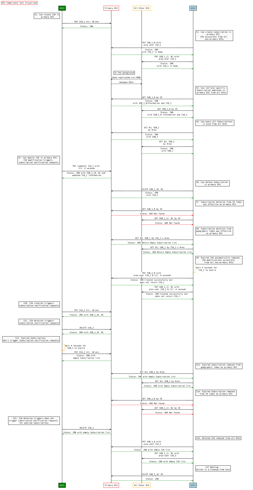

# ASTM F3411-22a NetRID DSS interoperability test scenario

## Overview

The test scenario in this folder verifies that two DSS instances implementing
the API required by ASTM F3411-22a in a shared DSS region  interoperate
correctly.  This is generally accomplished by performing an  operation on one
DSS instance and then verifying that the results are visible  in the other
instance.  Neither of the two DSS instances need to be an InterUSS Platform
implementation.

## Resources

### primary_dss_instance

A resources.astm.f3411.DSSInstanceResource containing the "primary" DSS instance for this scenario.

### all_dss_instances

A resources.astm.f3411.DSSInstancesResource containing at least two DSS instances complying with ASTM F3411-22a.

## Test sequence legend

* *P*: Primary DSS instance under test.  The sequence below is
intended to be repeated so that each DSS is the primary DSS under test for one
iteration of the sequence.
* *n*: Each of the other (non-Primary) DSS instances.
* ISA[*id*]: Reference to Identification Service Area with a particular test id
(test id index, not full UUID identifier).  Note that the same UUID should be
used for ISA[i] throughout the sequence even though the logical ISA may be
created and deleted multiple times.
* Subscription[*id*]: Reference to Subscription with a particular test *id*
(test id index, not full UUID identifier).  Note that the same UUID should be
used for Subscription[i] throughout the sequence even though the logical
Subscription may be created and deleted multiple times.
* D: Number of seconds needed to process requests to all DSS instances before
the note to wait >D seconds from a particular time

## Sequence diagram

## Prerequisites test case

### Test environment requirements test step

#### DSS instance is publicly addressable check
As per **[astm.f3411.v22a.DSS0210](../../../../requirements/astm/f3411/v22a.md)** the DSS instance should be publicly addressable.
As such, this check will fail if the resolved IP of the DSS host is a private IP address, unless that is explicitly
expected.

#### DSS instance is reachable check
As per **[astm.f3411.v22a.DSS0210](../../../../requirements/astm/f3411/v22a.md)** the DSS instance should be publicly addressable.
As such, this check will fail if the DSS is not reachable with a dummy query,

## Interoperability sequence test case

### [S1 test step](dss/test_steps/put_isa.md)

Action: USS1@DSS*P*: PUT ISA with no start time and end time 10 minutes from now

Qualitatively proves: Can create ISA in primary DSS

#### ISA[*P*] created with proper response check

**[astm.f3411.v22a.DSS0130,A2-6-1,1a](../../../../requirements/astm/f3411/v22a.md)**

### S2 test step

Action: USS2@DSS*n*: PUT Subscription with intersecting area, no start time

Qualitatively proves: Can create Subscription in primary DSS, ISA accessible from all non-primary DSSs

#### Subscription[*n*] created with proper response check

**[astm.f3411.v22a.DSS0130,A2-6-1,3a](../../../../requirements/astm/f3411/v22a.md)**

#### service_areas includes ISA from S1 check

**[astm.f3411.v22a.DSS0130,A2-6-1,1c](../../../../requirements/astm/f3411/v22a.md)**
**[astm.f3411.v22a.DSS0130,3,e](../../../../requirements/astm/f3411/v22a.md)**

#### ID of ISA from S1 is properly synchronized with all DSS check

**[astm.f3411.v22a.DSS0130,3,a](../../../../requirements/astm/f3411/v22a.md)**

#### Owner of ISA from S1 is properly synchronized with all DSS check

**[astm.f3411.v22a.DSS0130,3,b](../../../../requirements/astm/f3411/v22a.md)**

#### URL of ISA from S1 is properly synchronized with all DSS check

**[astm.f3411.v22a.DSS0130,3,c](../../../../requirements/astm/f3411/v22a.md)**

#### Start/end times of ISA from S1 are properly synchronized with all DSS check

**[astm.f3411.v22a.DSS0130,3,d](../../../../requirements/astm/f3411/v22a.md)**

### S3 test step

Action: USS2@DSS*n*: GET Subscription[*P*] by ID

Qualitatively proves: Can retrieve specific Subscription emplaced in primary DSS from all DSSs

#### Subscription[*P*] returned with proper response check

**[astm.f3411.v22a.DSS0130,A2-6-1,5](../../../../requirements/astm/f3411/v22a.md)**

**[astm.f3411.v22a.DSS0070](../../../../requirements/astm/f3411/v22a.md)** requires that all DSS instances in a pool return the same result. This check fails if the DSS instance does not return the same result as the other DSS instances.

#### Subscription[*P*] ID is properly synchronized with all DSS check

**[astm.f3411.v22a.DSS0130,2,a](../../../../requirements/astm/f3411/v22a.md)**

#### Subscription[*P*] owner is properly synchronized with all DSS check

**[astm.f3411.v22a.DSS0130,2,b](../../../../requirements/astm/f3411/v22a.md)**

#### Subscription[*P*] URL is properly synchronized with all DSS check

**[astm.f3411.v22a.DSS0130,2,c](../../../../requirements/astm/f3411/v22a.md)**

#### Subscription[*P*] start/end times are properly synchronized with all DSS check

**[astm.f3411.v22a.DSS0130,2,d](../../../../requirements/astm/f3411/v22a.md)**

#### Subscription[*P*] notification count is properly synchronized with all DSS check

**[astm.f3411.v22a.DSS0130,2,f](../../../../requirements/astm/f3411/v22a.md)**

### S4 test step

Action: USS2@DSS*n*: GET Subscriptions using ISA[*P*]’s area

Qualitatively proves: All Subscription[i] 1≤i≤n are returned in subscriptions with proper response

#### Can query all Subscriptions in area from all DSSs check

**[astm.f3411.v22a.DSS0130,A2-6-1,6](../../../../requirements/astm/f3411/v22a.md)**

**[astm.f3411.v22a.DSS0070](../../../../requirements/astm/f3411/v22a.md)** requires that all DSS instances in a pool return the same result. This check fails if the DSS instance does not return the same result as the other DSS instances.

### [S5 test step](dss/test_steps/put_isa.md)

Action: USS1@DSS*P*: PUT ISA[*P*] setting end time to now + D seconds

Qualitatively proves: ISA[*P*] modified with proper response, all Subscription[i] 1≤i≤n are returned in subscribers with proper response

#### Can get ISA from primary DSS check

**[astm.f3411.v22a.DSS0130,3,a](../../../../requirements/astm/f3411/v22a.md)**

#### Can modify ISA in primary DSS check

**[astm.f3411.v22a.DSS0130,A2-6-1,1b](../../../../requirements/astm/f3411/v22a.md)**

#### ISA modification triggers subscription notification requests check

TODO: Implement

**[astm.f3411.v22a.DSS0130,A2-6-1,3c](../../../../requirements/astm/f3411/v22a.md)**

### S6 test step

Action: USS2@DSS*P*: DELETE Subscription[*n*]

Qualitatively proves: Can delete Subscriptions in primary DSS

#### Subscription[*n*] deleted with proper response check

**[astm.f3411.v22a.DSS0130,A2-6-1,4a](../../../../requirements/astm/f3411/v22a.md)**

### S7 test step

Action: USS2@DSS*n*: GET Subscription[*n*] by ID

Qualitatively proves: Subscription deletion from ID index was effective from primary DSS

#### 404 with proper response check

**[astm.f3411.v22a.DSS0130,A2-6-1,4b](../../../../requirements/astm/f3411/v22a.md)**

**[astm.f3411.v22a.DSS0070](../../../../requirements/astm/f3411/v22a.md)** requires that all DSS instances in a pool return the same result. This check fails if the DSS instance does not return the same result as the other DSS instances.

### S8 test step

Action: USS2@DSS*n*: GET Subscriptions using ISA[*P*]’s area

Qualitatively proves: Subscription deletion from geographic index was effective from primary DSS

#### Subscriptions queried successfully check

**[astm.f3411.v22a.DSS0130,A2-6-1,6](../../../../requirements/astm/f3411/v22a.md)**

#### No Subscription[i] 1≤i≤n returned with proper response check

**[astm.f3411.v22a.DSS0130,A2-6-1,4b](../../../../requirements/astm/f3411/v22a.md)**

**[astm.f3411.v22a.DSS0070](../../../../requirements/astm/f3411/v22a.md)** requires that all DSS instances in a pool return the same result. This check fails if the DSS instance does not return the same result as the other DSS instances.

### S9 test step

Action: Wait >D seconds from S5 then USS2@DSS*n*: PUT Subscription with intersecting area, end time D seconds from now

Qualitatively proves: Expired ISA automatically removed, ISA modifications accessible from all non-primary DSSs

#### Subscription[*n*] created with proper response check

**[astm.f3411.v22a.DSS0130,A2-6-1,1c](../../../../requirements/astm/f3411/v22a.md)**

#### service_areas does not include ISA from S1 check

**[astm.f3411.v22a.DSS0130,A2-6-1,1d](../../../../requirements/astm/f3411/v22a.md)**

**[astm.f3411.v22a.DSS0070](../../../../requirements/astm/f3411/v22a.md)** requires that all DSS instances in a pool return the same result. This check fails if the DSS instance does not return the same result as the other DSS instances.

### [S10 test step](dss/test_steps/put_isa.md)

Action: USS1@DSS*P*: PUT ISA with no start time and end time 10 minutes from now

Qualitatively proves: ISA creation triggers subscription notification requests

#### ISA[*P*] created with proper response check

**[astm.f3411.v22a.DSS0130,A2-6-1,1a](../../../../requirements/astm/f3411/v22a.md)**

#### All Subscription[i] 1≤i≤n returned in subscribers check

**[astm.f3411.v22a.DSS0130,A2-6-1,3b](../../../../requirements/astm/f3411/v22a.md)**

### [S11 test step](dss/test_steps/delete_isa.md)

Action: USS1@DSS*P*: DELETE ISA[*P*]

Qualitatively proves: ISA deletion triggers subscription notification requests

#### ISA[*P*] deleted with proper response check

**[astm.f3411.v22a.DSS0130,A2-6-1,2a](../../../../requirements/astm/f3411/v22a.md)**

#### All Subscription[i] 1≤i≤n returned in subscribers check

**[astm.f3411.v22a.DSS0130,A2-6-1,3c](../../../../requirements/astm/f3411/v22a.md)**

### [S12 test step](dss/test_steps/put_isa.md)

Action: Wait >D seconds from S9 then USS1@DSS*P*: PUT ISA with no start time and end time 10 minutes from now

Qualitatively proves: Expired Subscriptions don’t trigger subscription notification requests

#### ISA[*P*] created with proper response check

**[astm.f3411.v22a.DSS0130,A2-6-1,1a](../../../../requirements/astm/f3411/v22a.md)**

#### None of Subscription[i] 1≤i≤n returned in subscribers check

**[astm.f3411.v22a.DSS0130,A2-6-1,3d](../../../../requirements/astm/f3411/v22a.md)**

### S13 test step

Action: USS2@DSS*n*: GET Subscriptions using ISA[*P*]’s area

Qualitatively proves: Expired Subscription removed from geographic index on primary DSS

#### Subscriptions queried successfully check

**[astm.f3411.v22a.DSS0130,A2-6-1,6](../../../../requirements/astm/f3411/v22a.md)**

#### No Subscription[i] 1≤i≤n returned with proper response check

**[astm.f3411.v22a.DSS0130,A2-6-1,3d](../../../../requirements/astm/f3411/v22a.md)**

**[astm.f3411.v22a.DSS0070](../../../../requirements/astm/f3411/v22a.md)** requires that all DSS instances in a pool return the same result. This check fails if the DSS instance does not return the same result as the other DSS instances.

### S14 test step

Action: USS2@DSS*n*: GET Subscription[*n*] by ID

Qualitatively proves: Expired Subscription removed from ID index on primary DSS

#### 404 with proper response check

TODO: Investigate expected behavior and "404 with proper response" check

**[astm.f3411.v22a.DSS0130,A2-6-1,3d](../../../../requirements/astm/f3411/v22a.md)**

### [S15 test step](dss/test_steps/delete_isa.md)

Action: USS1@DSS*P*: DELETE ISA[*P*]

Qualitatively proves: ISA deletion does not trigger subscription notification requests for expired Subscriptions

#### ISA[*P*] deleted with proper response check

**[astm.f3411.v22a.DSS0130,A2-6-1,2a](../../../../requirements/astm/f3411/v22a.md)**

#### None of Subscription[i] 1≤i≤n returned in subscribers with proper response check

**[astm.f3411.v22a.DSS0130,A2-6-1,3d](../../../../requirements/astm/f3411/v22a.md)**

### S16 test step

Action: USS2@DSS*n*: PUT Subscription with intersecting area, no start time

Qualitatively proves: Deleted ISA removed from all DSSs

#### Subscription[*n*] created with proper response check

**[astm.f3411.v22a.DSS0130,A2-6-1,3a](../../../../requirements/astm/f3411/v22a.md)**

#### service_areas does not include ISA from S12 check

**[astm.f3411.v22a.DSS0130,A2-6-1,2b](../../../../requirements/astm/f3411/v22a.md)**

**[astm.f3411.v22a.DSS0070](../../../../requirements/astm/f3411/v22a.md)** requires that all DSS instances in a pool return the same result. This check fails if the DSS instance does not return the same result as the other DSS instances.

### S17 test step

Action: USS2@DSS*P*: DELETE Subscription[*n*]

#### Subscription[*n*] deleted with proper response check

**[astm.f3411.v22a.DSS0130,A2-6-1,4a](../../../../requirements/astm/f3411/v22a.md)**

## Cleanup

Any entities (ISAs or Subscriptions) not deleted normally will be deleted here.

### ISA deleted with proper response check

**[astm.f3411.v22a.DSS0130,A2-6-1,2a](../../../../requirements/astm/f3411/v22a.md)**

### Subscription can be queried by ID check

**[astm.f3411.v22a.DSS0130,A2-6-1,4a](../../../../requirements/astm/f3411/v22a.md)**

### Subscription can be deleted check

**[astm.f3411.v22a.DSS0130,A2-6-1,4a](../../../../requirements/astm/f3411/v22a.md)**
