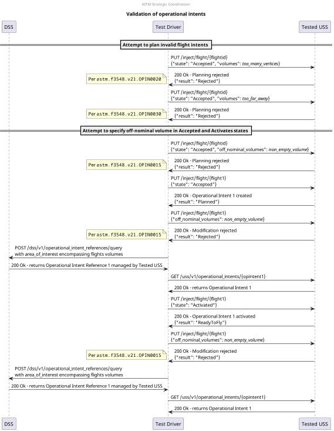

# Validation of operational intents test scenario

## Description
This test checks that the USS validates correctly the operational intents it creates.
Notably the following requirements:
- **[astm.f3548.v21.OPIN0015](../../../../requirements/astm/f3548/v21.md)**
- **[astm.f3548.v21.OPIN0020](../../../../requirements/astm/f3548/v21.md)**
- **[astm.f3548.v21.OPIN0030](../../../../requirements/astm/f3548/v21.md)**

## Sequence

## Resources
### flight_intents
FlightIntentsResource that provides the following flight intents:
- `valid_flight`: a valid operational intent upon which other invalid ones are derived, in `Accepted` state
  - `valid_activated`: state mutation `Activated`
  - `invalid_accepted_offnominal`: off-nominal volumes mutation: has (any valid) off-nominal volume
    - `invalid_activated_offnominal`: state mutation `Activated`
  - `invalid_too_far_away`: reference time mutation: reference time pulled back so that it is like the operational intent is attempted to be planned more than OiMaxPlanHorizon = 30 days ahead of time
  - `valid_conflict_tiny_overlap`: volumes mutation: has a volume that overlaps with `valid_op_intent` just above IntersectionMinimumPrecision = 1cm in a way that must result as a conflict

### tested_uss
FlightPlannerResource that will be tested for its validation of operational intents.

### dss
DSSInstanceResource that provides access to a DSS instance where flight creation/sharing can be verified.

## Setup test case
### Check for necessary capabilities test step
The USSs is queried for its capabilities to ensure this test can proceed.

#### Valid responses check
If the USS does not respond appropriately to the endpoint queried to determine capability, this check will fail.

#### Support BasicStrategicConflictDetection check
This check will fail if the flight planner does not support BasicStrategicConflictDetection per
**[astm.f3548.v21.GEN0310](../../../../requirements/astm/f3548/v21.md)** as the USS does not support the InterUSS
implementation of that requirement.

### Area clearing test step
The tested USS is requested to remove all flights from the area under test.

#### Area cleared successfully check
**[interuss.automated_testing.flight_planning.ClearArea](../../../../requirements/interuss/automated_testing/flight_planning.md)**

## Attempt to plan invalid flight intents test case
### Attempt to plan flight intent too far ahead of time test step
The user flight intent that the test driver attempts to plan has a reference time that is more than
OiMaxPlanHorizon = 30 days ahead of time from the actual intent. As such, the planning attempt should be rejected.

#### Incorrectly planned check
If the USS successfully plans the flight or otherwise fails to indicate a rejection, it means that it failed to validate
the intent provided.  Therefore, this check will fail if the USS indicates success in creating the flight from the user
flight intent, per **[astm.f3548.v21.OPIN0030](../../../../requirements/astm/f3548/v21.md)**.

#### Failure check
All flight intent data provided was complete and correct. It should have been processed successfully, allowing the USS
to reject or accept the flight. If the USS indicates that the injection attempt failed, this check will fail per
**[interuss.automated_testing.flight_planning.ExpectedBehavior](../../../../requirements/interuss/automated_testing/flight_planning.md)**.

### [Validate flight intent too far ahead of time not planned test step](../validate_not_shared_operational_intent.md)

## Attempt to specify off-nominal volume in Accepted and Activates states test case
### Attempt to plan flight with an off-nominal volume test step
The user flight intent that the test driver attempts to plan has an off-nominal volume.
As such, the planning attempt should be rejected.

#### Incorrectly planned check
If the USS successfully plans the flight or otherwise fails to indicate a rejection, it means that it failed to validate
the intent provided.  Therefore, this check will fail if the USS indicates success in creating the flight from the user
flight intent, per **[astm.f3548.v21.OPIN0015](../../../../requirements/astm/f3548/v21.md)**.

#### Failure check
All flight intent data provided was complete and correct. It should have been processed successfully, allowing the USS
to reject or accept the flight. If the USS indicates that the injection attempt failed, this check will fail per
**[interuss.automated_testing.flight_planning.ExpectedBehavior](../../../../requirements/interuss/automated_testing/flight_planning.md)**.

### [Validate flight intent with an off-nominal volume not planned test step](../validate_not_shared_operational_intent.md)

### [Plan valid flight intent test step](../../../flight_planning/plan_flight_intent.md)
The valid flight intent should be successfully planned by the flight planner.

### Attempt to modify planned flight with an off-nominal volume test step
The user flight intent that the test driver attempts to modify has an off-nominal volume and is in the `Accepted` state.
As such, the modification attempt should be rejected.

#### Incorrectly modified check
If the USS successfully modifies the flight or otherwise fails to indicate a rejection, it means that it failed to validate
the intent provided.  Therefore, this check will fail if the USS indicates success in modifying the flight from the user
flight intent, per **[astm.f3548.v21.OPIN0015](../../../../requirements/astm/f3548/v21.md)**.

#### Failure check
All flight intent data provided was complete and correct. It should have been processed successfully, allowing the USS
to reject or accept the flight. If the USS indicates that the injection attempt failed, this check will fail per
**[interuss.automated_testing.flight_planning.ExpectedBehavior](../../../../requirements/interuss/automated_testing/flight_planning.md)**.

### [Validate planned flight not modified test step](../validate_shared_operational_intent.md)
Validate that the planned flight intent was not modified with an off-nominal volume.

### [Activate valid flight intent test step](../../../flight_planning/activate_flight_intent.md)
The valid flight intent should be successfully activated by the flight planner.

### Attempt to modify activated flight with an off-nominal volume test step
The user flight intent that the test driver attempts to modify has an off-nominal volume and is in the `Activated` state.
As such, the modification attempt should be rejected.

#### Incorrectly modified check
If the USS successfully modifies the flight or otherwise fails to indicate a rejection, it means that it failed to validate
the intent provided.  Therefore, this check will fail if the USS indicates success in modifying the flight from the user
flight intent, per **[astm.f3548.v21.OPIN0015](../../../../requirements/astm/f3548/v21.md)**.

#### Failure check
All flight intent data provided was complete and correct. It should have been processed successfully, allowing the USS
to reject or accept the flight. If the USS indicates that the injection attempt failed, this check will fail per
**[interuss.automated_testing.flight_planning.ExpectedBehavior](../../../../requirements/interuss/automated_testing/flight_planning.md)**.

### [Validate activated flight not modified test step](../validate_shared_operational_intent.md)
Validate that the activated flight intent was not modified with an off-nominal volume.

TODO: add cases for astm.f3548.v21.OPIN0040 + astm.f3548.v21.GEN0500 that use the flight intents declared as resources but not used

## Cleanup
### Successful flight deletion check
**[interuss.automated_testing.flight_planning.DeleteFlightSuccess](../../../../requirements/interuss/automated_testing/flight_planning.md)**
