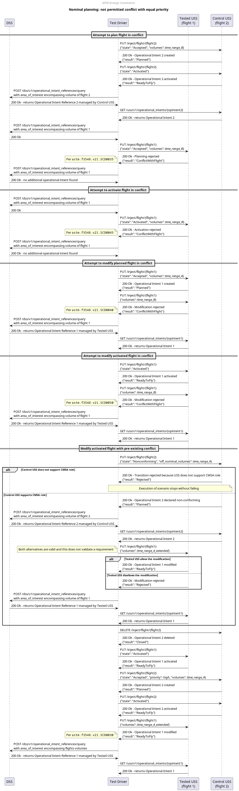

# Nominal planning: not permitted conflict with equal priority test scenario

## Description
This test aims at testing the strategic coordination requirements that relate to the prioritization scenarios where
there exists a conflict with an equal priority flight that is not permitted by regulation:
- **[astm.f3548.v21.SCD0035](../../../../../requirements/astm/f3548/v21.md)**
- **[astm.f3548.v21.SCD0040](../../../../../requirements/astm/f3548/v21.md)**
- **[astm.f3548.v21.SCD0045](../../../../../requirements/astm/f3548/v21.md)**
- **[astm.f3548.v21.SCD0050](../../../../../requirements/astm/f3548/v21.md)**

It involves a tested USS and a control USS through which conflicting flights are injected.

This scenario skips execution and completes successfully at the setup case if a resource containing equal priority flight intents where conflicts are not allow is not provided, such as if a jurisdiction does not have any priority levels at which conflicts are not allowed.

## Sequence

## Resources
### flight_intents
If the jurisdiction in which these tests are being conducted does not have a priority level at which conflicts are not allowed, the FlightIntentsResource must be None to prevent the
execution of the test.

Otherwise, the FlightIntentsResource must provide the following flight intents:

- For flight 1:
    - `flight_1_planned_time_range_A`: flight used for the tested USS
        - original time range `time_range_A` (e.g. 1pm to 2pm)
    - `flight_1_activated_time_range_A`: state mutation `Activated`
    - `flight_1_activated_time_range_A_extended`: mutation of volume in time to extend original time range (e.g. 12pm to 2pm)
    - `flight_1_planned_time_range_B`: mutation of volume in time to not intersect with `time_range_A` or `time_range_A_extended` (e.g. 4pm to 5pm)
    - `flight_1_activated_time_range_B`: state mutation `Activated`

- For flight 2:
    - `flight_2_equal_prio_planned_time_range_B`: flight used for the control USS
        - original time range `time_range_B` that does not intersect with `time_range_A` or `time_range_A_extended` (e.g. 4pm to 5pm)
        - must have equal priority than flight 1
        - must intersect flight 1 in space
    - `flight_2_equal_prio_activated_time_range_B`: state mutation `Activated`
    - `flight_2_equal_prio_nonconforming_time_range_A`: state mutation `Nonconforming`
      - must have an off-nominal volume with time range `time_range_A`

### tested_uss
FlightPlannerResource that is under test and will manage flight 1.

### control_uss
FlightPlannerResource that will be used to inject conflicting flight 2. Note that this control USS needs to support the
CMSA role in order to transition some flight intents to the `Nonconforming` state.

### dss
DSSInstanceResource that provides access to a DSS instance where flight creation/sharing can be verified.

## Setup test case
### Check for flight planning readiness test step
Both USSs are queried for their readiness to ensure this test can proceed.

#### Flight planning USS not ready check
If either USS does not respond appropriately to the endpoint queried to determine readiness, this check will fail and the USS will have failed to meet **[astm.f3548.v21.GEN0310](../../../../../requirements/astm/f3548/v21.md)** as the USS does not support the InterUSS implementation of that requirement.

### Area clearing test step
Both USSs are requested to remove all flights from the area under test.

#### Area cleared successfully check
**[interuss.automated_testing.flight_planning.ClearArea](../../../../../requirements/interuss/automated_testing/flight_planning.md)**

## Attempt to plan flight in conflict test case
### [Plan flight 2 test step](../../../../flight_planning/plan_flight_intent.md)
Flight 2 on time range B should be successfully planned by the control USS.

### [Validate flight 2 sharing test step](../../validate_shared_operational_intent.md)

### [Activate flight 2 test step](../../../../flight_planning/activate_flight_intent.md)
Flight 2 on time range B should be successfully activated by the control USS.

### [Validate flight 2 sharing test step](../../validate_shared_operational_intent.md)
Validate that flight 2 is activated on time range B.

### [Attempt to plan flight 1 test step](../../../../flight_planning/plan_conflict_flight_intent.md)
The test driver attempts to plan the flight 1 on time range B via the tested USS. However, it conflicts with flight 2
which is of equal priority but came first. As such it should be rejected
per **[astm.f3548.v21.SCD0035](../../../../../requirements/astm/f3548/v21.md)**.

### [Validate flight 1 not shared test step](../../validate_not_shared_operational_intent.md)
Flight 1 should not have been planned.

## Attempt to activate flight in conflict test case
### [Attempt to directly activate conflicting flight 1 test step](../../../../flight_planning/activate_conflict_flight_intent.md)
The test driver attempts to activate directly flight 1 onto time range B, i.e. without the flight being planned before.
However, this conflicts with activated flight 2, which is of equal priority. As such it should be rejected
per **[astm.f3548.v21.SCD0045](../../../../../requirements/astm/f3548/v21.md)**.

### [Validate flight 1 not shared test step](../../validate_not_shared_operational_intent.md)
Flight 1 should not have been activated directly.

## Attempt to modify planned flight in conflict test case
### [Plan flight 1 test step](../../../../flight_planning/plan_flight_intent.md)
Flight 1 on time range A should be successfully planned by the tested USS.

### [Validate flight 1 sharing test step](../../validate_shared_operational_intent.md)

### [Attempt to modify planned flight 1 in conflict test step](../../../../flight_planning/modify_planned_conflict_flight_intent.md)
The test driver attempts to modify flight 1 via the tested USS so that it becomes planned on time range B.
However, this conflicts with flight 2, which is of equal priority but was planned first.
As such it should be rejected per **[astm.f3548.v21.SCD0040](../../../../../requirements/astm/f3548/v21.md)**.

### [Validate flight 1 not modified test step](../../validate_shared_operational_intent.md)
Because the modification attempt was invalid, either Flight 1 should not have been modified (because the USS kept the
original accepted request), or it should have been removed (because the USS rejected the replacement plan provided).

## Attempt to modify activated flight in conflict test case
### [Activate flight 1 test step](../../../../flight_planning/activate_flight_intent.md)
The test driver activates flight 1 onto its time range A, which should be done successfully.
Note that flight 1 could be either planned or non-existent before this step. In the latter case, the flight will be
directly activated without being planned beforehand.

### [Validate flight 1 sharing test step](../../validate_shared_operational_intent.md)

### [Attempt to modify activated flight 1 in conflict test step](../../../../flight_planning/modify_activated_conflict_flight_intent.md)
The test driver attempts to modify flight 1 so that it becomes in conflict with flight 2 onto time range B.
Both flights are activated at that point. However, because the conflict did not exist when the modification was
initiated, it should be rejected per **[astm.f3548.v21.SCD0050](../../../../../requirements/astm/f3548/v21.md)**.

### [Validate flight 1 not modified test step](../../validate_shared_operational_intent.md)
Because the modification attempt was invalid, either Flight 1 should not have been modified (because the USS kept the
original accepted request), or it should have been removed (because the USS rejected the replacement plan provided).

## Modify activated flight with pre-existing conflict test case
### [Activate flight 1 test step](../../../../flight_planning/activate_flight_intent.md)
The test driver activates flight 1 onto its time range A, which should be done successfully.
Note that flight 1 could be either already activated or non-existent before this step. In the former case, the call is
idempotent and nothing should change. In the latter case, the flight will be directly activated without being planned
beforehand.

### [Validate flight 1 sharing test step](../../validate_shared_operational_intent.md)

### Declare flight 2 non-conforming test step
The test driver instructs the control USS to declare flight 2 as non-conforming with an off-nominal volume onto time
range A. This makes non-conforming flight 2 conflicts with activated flight 1.

Do note that executing this test step requires the control USS to support the CMSA role. As such, if the USS rejects the
transition to non-conforming state, it will be assumed that the control USS does not support this role and the test
execution will stop without failing.

#### Successful transition to non-conforming state check
All flight intent data provided is correct and notably contains an off-nominal volume, therefore it should have been
transitioned to non-conforming state by the USS
per **[interuss.automated_testing.flight_planning.ExpectedBehavior](../../../../../requirements/interuss/automated_testing/flight_planning.md)**.
If the USS indicates a conflict, this check will fail. If the USS indicates that the injection attempt failed, this check will fail.

#### Failure check
All flight intent data provided was complete and correct. It should have been processed successfully, allowing the USS
to reject or accept the flight. If the USS indicates that the injection attempt failed, this check will fail per
**[interuss.automated_testing.flight_planning.ExpectedBehavior](../../../../../requirements/interuss/automated_testing/flight_planning.md)**.

### [Validate flight 2 sharing test step](../../validate_shared_operational_intent.md)

### Attempt to modify activated flight 1 in conflict with activated flight 2 test step
Before execution of this step, flight 1 is activated (onto time range A) and flight 2 is non-conforming (onto time range
A), and both are in conflict. The test driver modifies flight 1 in a way that still conflicts with flight 2 by extending
its time range A.
This modification results in a conflict between the two equal priority flight that already existed before the
modification was initiated. While this modification is expected to be accepted by the tested USS in general, the
rejection of the modification does not constitute a violation of a requirement. However, the modification request must
not result in a failure per **[interuss.automated_testing.flight_planning.ExpectedBehavior](../../../../../requirements/interuss/automated_testing/flight_planning.md)**.

#### Successful modification or rejection check
All flight intent data provided is correct and the USS should have either successfully modified the flight or rejected
properly the modification per **[interuss.automated_testing.flight_planning.ExpectedBehavior](../../../../../requirements/interuss/automated_testing/flight_planning.md)**.
If the USS indicates that the injection attempt failed, this check will fail.

#### Failure check
All flight intent data provided was complete and correct. It should have been processed successfully, allowing the USS
to reject or accept the flight. If the USS indicates that the injection attempt failed, this check will fail per
**[interuss.automated_testing.flight_planning.ExpectedBehavior](../../../../../requirements/interuss/automated_testing/flight_planning.md)**.

### [Validate flight 1 test step](../../validate_shared_operational_intent.md)
This step validates that the response of the USS is consistent with the flight shared, i.e. either it was properly
modified, or the USS considered the attempt invalid. In the latter case, because the modification attempt was invalid,
either Flight 1 should not have been modified (because the USS kept the original accepted request), or it should have
been removed (because the USS rejected the replacement plan provided).

## Cleanup
### Successful flight deletion check
**[interuss.automated_testing.flight_planning.DeleteFlightSuccess](../../../../../requirements/interuss/automated_testing/flight_planning.md)**
