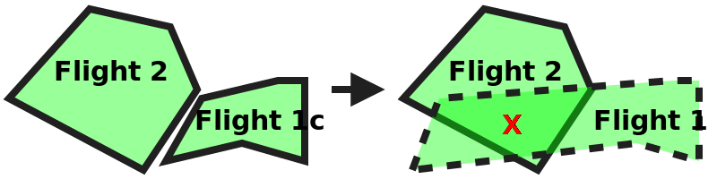
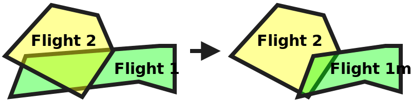

# Nominal planning: not permitted conflict with equal priority test scenario

## Description
This test aims at testing the strategic coordination requirements that relate to the prioritization scenarios where
there exists a conflict with an equal priority flight that is not permitted by regulation:
- **[astm.f3548.v21.SCD0035](../../../../../requirements/astm/f3548/v21.md)**
- **[astm.f3548.v21.SCD0040](../../../../../requirements/astm/f3548/v21.md)**
- **[astm.f3548.v21.SCD0045](../../../../../requirements/astm/f3548/v21.md)**
- **[astm.f3548.v21.SCD0050](../../../../../requirements/astm/f3548/v21.md)**

It involves a tested USS and a control USS through which conflicting flights are injected.

This scenario skips execution and completes successfully at the setup case if a resource containing equal priority flight intents where conflicts are not allow is not provided, such as if a jurisdiction does not have any priority levels at which conflicts are not allowed.

It assumes that the area used in the scenario is already clear of any pre-existing flights (using, for instance, PrepareFlightPlanners scenario).

## Resources
### flight_intents
If the jurisdiction in which these tests are being conducted does not have a priority level at which conflicts are not allowed, the FlightIntentsResource must be None to prevent the
execution of this test.

Otherwise, the FlightIntentsResource must provide the following flight intents:

<table>
  <tr>
    <th>Flight intent ID</th>
    <th>Flight name</th>
    <th>Priority</th>
    <th>State</th><!-- TODO: Update with usage_state and uas_state when new flight planning API is adopted -->
    <th>Must conflict with</th>
    <th>Must not conflict with</th>
  </tr>
  <tr>
    <td><code>flight1_planned</code></td>
    <td rowspan="2">Flight 1</td>
    <td rowspan="9">Any (but all the same)</td>
    <td>Accepted</td>
    <td rowspan="2">Flight 2</td>
    <td rowspan="2">N/A</td>
  </tr>
  <tr>
    <td><code>flight1_activated</code></td>
    <td>Activated</td>
  </tr>
  <tr>
    <td><code>flight1m_activated</code></td>
    <td>Flight 1m</td>
    <td>Activated</td>
    <td>Flight 2</td>
    <td>N/A</td>
  </tr>
  <tr>
    <td><code>flight1c_planned</code></td>
    <td rowspan="2">Flight 1c</td>
    <td>Planned</td>
    <td rowspan="2">N/A</td>
    <td rowspan="2">Flight 2</td>
  </tr>
  <tr>
    <td><code>flight1c_activated</code></td>
    <td>Activated</td>
  </tr>
  <tr>
    <td><code>equal_prio_flight2m_planned</code></td>
    <td>Flight 2m</td>
    <td rowspan="2">Planned</td>
    <td>N/A</td>
    <td>Flight 1</td>
  </tr>
  <tr>
    <td><code>equal_prio_flight2_planned</code></td>
    <td rowspan="3">Flight 2</td>
    <td rowspan="3">Flight 1, Flight 1m</td>
    <td rowspan="3">Flight 1c</td>
  </tr>
  <tr>
    <td><code>equal_prio_flight2_activated</code></td>
    <td>Activated</td>
  </tr>
  <tr>
    <td><code>equal_prio_flight2_nonconforming</code></td>
    <td>Nonconforming</td>
  </tr>
</table>

Because the scenario involves activation of intents, all activated intents must be active during the execution of the
test scenario. Additionally, their end time must leave sufficient time for the execution of the test scenario. For the
sake of simplicity, it is recommended to set the start and end times of all the intents to the same range.

### tested_uss
FlightPlannerResource that is under test and will manage Flight 1 and its variants.

### control_uss
FlightPlannerResource that will be used to inject conflicting Flight 2. Note that this control USS needs to support the
CMSA role in order to transition to the `Nonconforming` state in order to create a pre-existing conflict among equal-priority operational intents.

### dss
DSSInstanceResource that provides access to a DSS instance where flight creation/sharing can be verified.

## Attempt to plan flight into conflict test case

### Plan Flight 2 test step

#### [Plan Flight 2](../../../../flight_planning/plan_flight_intent.md)
Flight 2 should be successfully planned by the control USS.

### [Validate Flight 2 sharing test step](../../validate_shared_operational_intent.md)

### [Activate Flight 2 test step](../../../../flight_planning/activate_flight_intent.md)
Flight 2 should be successfully activated by the control USS.

### [Validate Flight 2 sharing test step](../../validate_shared_operational_intent.md)

### [Attempt to plan Flight 1 test step](../../../../flight_planning/plan_conflict_flight_intent.md)
The test driver attempts to plan the Flight 1 via the tested USS. However, it conflicts with Flight 2
which is of equal priority but came first. As such it should be rejected
per **[astm.f3548.v21.SCD0035](../../../../../requirements/astm/f3548/v21.md)**.

### [Validate Flight 1 not shared test step](../../validate_not_shared_operational_intent.md)
Flight 1 should not have been shared with the interoperability ecosystem since it was rejected.

## Attempt to activate flight into conflict test case

### [Attempt to directly activate conflicting Flight 1 test step](../../../../flight_planning/activate_conflict_flight_intent.md)
The test driver attempts to activate directly Flight 1, i.e. without the flight being planned before.
However, this conflicts with activated Flight 2, which is of equal priority. As such it should be rejected
per **[astm.f3548.v21.SCD0045](../../../../../requirements/astm/f3548/v21.md)**.

### [Validate Flight 1 not shared test step](../../validate_not_shared_operational_intent.md)
Flight 1 should not have been shared with the interoperability ecosystem since it was rejected.

## Attempt to modify planned flight into conflict test case

### [Plan Flight 1c test step](../../../../flight_planning/plan_flight_intent.md)
The smaller Flight 1c form (which doesn't conflict with Flight 2) should be successfully planned by the tested USS.

### [Validate Flight 1c sharing test step](../../validate_shared_operational_intent.md)

### [Attempt to modify planned Flight 1c into conflict test step](../../../../flight_planning/modify_planned_conflict_flight_intent.md)
The test driver attempts to enlarge Flight 1c so that it conflicts with Flight 2.
However, Flight 2 is of equal priority but was planned first.
As such the change to Flight 1c should be rejected per **[astm.f3548.v21.SCD0040](../../../../../requirements/astm/f3548/v21.md)**.

### [Validate Flight 1c not modified test step](../../validate_shared_operational_intent.md)
Because the modification attempt was invalid, either Flight 1c should not have been modified (because the USS kept the
original accepted request), or it should have been removed (because the USS rejected the replacement plan provided).

## Attempt to modify activated flight into conflict test case

### [Activate Flight 1c test step](../../../../flight_planning/activate_flight_intent.md)
The test driver activates the smaller Flight 1c form, which should be done successfully.
Note that Flight 1c could be either planned or non-existent before this step. In the latter case, the "user" will
directly activate the flight without planning it beforehand.

### [Validate Flight 1c sharing test step](../../validate_shared_operational_intent.md)

### [Attempt to modify activated Flight 1c into conflict test step](../../../../flight_planning/modify_activated_conflict_flight_intent.md)
The test driver attempts to enlarge Flight 1c so that it conflicts with Flight 2.
Both flights are activated at the point where that change is requested. However, because the conflict did not
exist when the modification was initiated, it should be rejected per **[astm.f3548.v21.SCD0050](../../../../../requirements/astm/f3548/v21.md)**.

### [Validate Flight 1c not modified test step](../../validate_shared_operational_intent.md)
Because the modification attempt was invalid, either Flight 1c should not have been modified (because the USS kept the
original accepted request), or it should have been removed (because the USS rejected the replacement plan provided).

### [Delete Flight 2 test step](../../../../flight_planning/delete_flight_intent.md)
To prepare for the next test case, Flight 2 must be removed from the system.

## Modify activated flight with pre-existing conflict test case

### [Activate Flight 1 test step](../../../../flight_planning/activate_flight_intent.md)
The test driver activates the normal form of Flight 1, which should be done successfully since Flight 2 was removed at the end of the previous step.
Note that Flight 1 could be either already activated in the smaller Flight 1c form or non-existent before this step. In the former case, Flight 1c is enlarged to its normal size. In the latter case, the flight will be directly activated without being planned beforehand.

### [Validate Flight 1 sharing test step](../../validate_shared_operational_intent.md)

### [Plan Flight 2m test step](../../../../flight_planning/plan_flight_intent.md)
The smaller Flight 2 form should be successfully planned by the control USS because it does not conflict with Flight 1.

### [Validate Flight 2m sharing test step](../../validate_shared_operational_intent.md)

### Declare Flight 2 non-conforming test step
The test driver instructs the control USS to declare Flight 2 as non-conforming. This makes non-conforming Flight 2 conflict with activated Flight 1 -- this same-priority conflict would not be allowed if Flight 2 were in a nominal state.

Do note that executing this test step requires the control USS to support the CMSA role. As such, if the USS rejects the
transition to non-conforming state, it will be assumed that the control USS does not support this role and the test
execution will stop without failing.

#### ℹ️ Successful transition to non-conforming state check
All flight intent data provided is correct, therefore it should have been
transitioned to non-conforming state by the USS
per **[interuss.automated_testing.flight_planning.ExpectedBehavior](../../../../../requirements/interuss/automated_testing/flight_planning.md)**.
If the USS indicates a conflict, this check will fail. If the USS indicates that the injection attempt failed, this check will fail.

#### 🛑 Failure check
All flight intent data provided was complete and correct. It should have been processed successfully, allowing the USS
to reject or accept the flight. If the USS indicates that the injection attempt failed, this check will fail per
**[interuss.automated_testing.flight_planning.ExpectedBehavior](../../../../../requirements/interuss/automated_testing/flight_planning.md)**.

### [Validate Flight 2 sharing test step](../../validate_shared_operational_intent.md)

### Attempt to modify activated Flight 1 in conflict with nonconforming Flight 2 test step
Before execution of this step, Flight 1 is activated (onto time range A) and Flight 2 is non-conforming (onto time range
A), and both are in conflict. The test driver modifies Flight 1 in a way that still conflicts with Flight 2 by extending
its time range A.
This modification results in a conflict between the two equal priority flight that already existed before the
modification was initiated. While this modification is expected to be accepted by the tested USS in general, the
rejection of the modification does not constitute a violation of a requirement. However, the modification request must
not result in a failure per **[interuss.automated_testing.flight_planning.ExpectedBehavior](../../../../../requirements/interuss/automated_testing/flight_planning.md)**.

#### 🛑 Successful modification or rejection check
All flight intent data provided is correct and the USS should have either successfully modified the flight or rejected
properly the modification per **[interuss.automated_testing.flight_planning.ExpectedBehavior](../../../../../requirements/interuss/automated_testing/flight_planning.md)**.
If the USS indicates that the injection attempt failed, this check will fail.

#### 🛑 Failure check
All flight intent data provided was complete and correct. It should have been processed successfully, allowing the USS
to reject or accept the flight. If the USS indicates that the injection attempt failed, this check will fail per
**[interuss.automated_testing.flight_planning.ExpectedBehavior](../../../../../requirements/interuss/automated_testing/flight_planning.md)**.

### [Validate Flight 1 test step](../../validate_shared_operational_intent.md)
This step validates that the response of the USS is consistent with the flight shared, i.e. either it was properly
modified, or the USS considered the attempt invalid. In the latter case, because the modification attempt was invalid,
either Flight 1 should not have been modified (because the USS kept the original accepted request), or it should have
been removed (because the USS rejected the replacement plan provided).

## Cleanup
### ⚠️ Successful flight deletion check
**[interuss.automated_testing.flight_planning.DeleteFlightSuccess](../../../../../requirements/interuss/automated_testing/flight_planning.md)**
