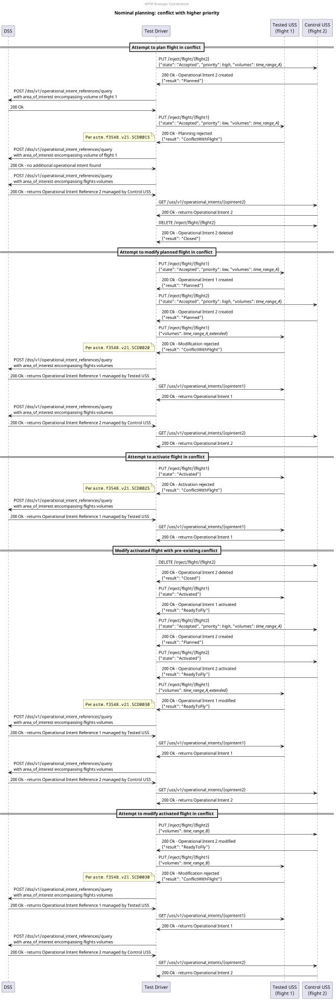

# Nominal planning: conflict with higher priority test scenario

## Description
This test aims to test the strategic coordination requirements that relate to the prioritization scenarios where there
exists a conflict with a higher priority flight:
- **[astm.f3548.v21.SCD0015](../../../../../requirements/astm/f3548/v21.md)**
- **[astm.f3548.v21.SCD0020](../../../../../requirements/astm/f3548/v21.md)**
- **[astm.f3548.v21.SCD0025](../../../../../requirements/astm/f3548/v21.md)**
- **[astm.f3548.v21.SCD0030](../../../../../requirements/astm/f3548/v21.md)**

It involves a tested USS and a control USS through which conflicting flights are injected.

## Sequence

## Resources
### flight_intents
FlightIntentsResource that provides the 8 following flight intents:

- For flight 1:
    - `flight_1_planned_time_range_A`: used for the test lower priority flight
        - original time range `time_range_A` (e.g. 1pm to 2pm)
    - `flight_1_planned_time_range_A_extended`: mutation of volume in time to extend original time range (e.g. 12pm to 2pm)
    - `flight_1_activated_time_range_A`: state mutation `Activated`
    - `flight_1_activated_time_range_A_extended`: mutation of volume in time to extend original time range (e.g. 12pm to 2pm)
    - `flight_1_activated_time_range_B`: mutation of volume in time to not intersect with `time_range_A` or `time_range_A_extended` (e.g. 4pm to 5pm)

- For flight 2:
    - `flight_2_planned_time_range_A`: used for the higher priority flight
        - original time range `time_range_A` (e.g. 1pm to 2pm)
        - must have higher priority than flight 1
        - must intersect flight 1 in space
    - `flight_2_activated_time_range_A`: state mutation `Activated`
    - `flight_2_activated_time_range_B`: mutation of volume in time to not intersect with `time_range_A` or `time_range_A_extended` (e.g. 4pm to 5pm)

### tested_uss
FlightPlannerResource that is under test and will manage the first lower priority flight.

### control_uss
FlightPlannerResource that will be used to inject conflicting flight 2.

### dss
DSSInstanceResource that provides access to a DSS instance where flight creation/sharing can be verified.

## Setup test case

### Check for necessary capabilities test step
Both USSs are queried for their capabilities to ensure this test can proceed.

#### Valid responses check
If either USS does not respond appropriately to the endpoint queried to determine capability, this check will fail.

#### Support BasicStrategicConflictDetection check
This check will fail if the first flight planner does not support BasicStrategicConflictDetection per
**[astm.f3548.v21.GEN0310](../../../../../requirements/astm/f3548/v21.md)** as the USS does not support the InterUSS
implementation of that requirement.  If the second flight planner does not support HighPriorityFlights, this scenario
will end normally at this point.

### Area clearing test step
Both USSs are requested to remove all flights from the area under test.

#### Area cleared successfully check
**[interuss.automated_testing.flight_planning.ClearArea](../../../../../requirements/interuss/automated_testing/flight_planning.md)**

## Attempt to plan flight in conflict test case
### [Plan flight 2 test step](../../../../flight_planning/plan_flight_intent.md)
The higher priority flight should be successfully planned by the control USS.

### [Attempt to plan flight 1 test step](../../../../flight_planning/plan_priority_conflict_flight_intent.md)
The test driver attempts to plan the flight 1 via the tested USS. However, it conflicts with flight 2, which is of
higher priority. As such it should be rejected per **[astm.f3548.v21.SCD0015](../../../../../requirements/astm/f3548/v21.md)**.

### [Validate flight 2 sharing test step](../../validate_shared_operational_intent.md)

TODO: add validation test step that op intent for flight 1 was not created

## Attempt to modify planned flight in conflict test case
### [Delete flight 2 test step](../../../../flight_planning/delete_flight_intent.md)

### [Plan flight 1 test step](../../../../flight_planning/plan_flight_intent.md)
The first flight should be successfully planned by the tested USS.

### [Plan flight 2 test step](../../../../flight_planning/plan_flight_intent.md)
The second flight should be successfully planned by the control USS.
It conflicts with flight 1, but it has higher priority.

### [Attempt to modify planned flight 1 in conflict test step](../../../../flight_planning/modify_planned_priority_conflict_flight_intent.md)
The test driver attempts to modify flight 1 via the tested USS, which is planned.
However, it conflicts with flight 2, which is of higher priority and was planned in the meantime.
As such it should be rejected per **[astm.f3548.v21.SCD0020](../../../../../requirements/astm/f3548/v21.md)**.

### [Validate flight 1 sharing test step](../../validate_shared_operational_intent.md)
The first flight should not have been modified.

### [Validate flight 2 sharing test step](../../validate_shared_operational_intent.md)

## Attempt to activate flight in conflict test case
### [Attempt to activate conflicting flight 1 test step](../../../../flight_planning/activate_priority_conflict_flight_intent.md)
The test driver attempts to activate planned flight 1, however, it conflicts with flight 2, which is also planned and of
higher priority.
As such it should be rejected per **[astm.f3548.v21.SCD0025](../../../../../requirements/astm/f3548/v21.md)**.

### [Validate flight 1 sharing test step](../../validate_shared_operational_intent.md)
The first flight should not have been activated.

## Modify activated flight with pre-existing conflict test case
### [Delete flight 2 test step](../../../../flight_planning/delete_flight_intent.md)

### [Activate flight 1 test step](../../../../flight_planning/activate_flight_intent.md)
The test driver activates flight 1, which should be done successfully given that it is now the highest-priority flight.

### [Plan flight 2 test step](../../../../flight_planning/plan_flight_intent.md)
The second flight should be successfully planned by the control USS.

### [Activate flight 2 test step](../../../../flight_planning/activate_flight_intent.md)
The test driver activates flight 2, which should be done successfully given that it is the highest-priority flight.

### [Modify activated flight 1 in conflict with activated flight 2 test step](../../../../flight_planning/modify_activated_flight_intent.md)
Before execution of this step, flights 1 and 2 are activated and in conflict.
The test driver modifies flight 1 in a way that still conflicts with flight 2.
Even though flight 2 is the highest-priority flight, because the conflict existed before the modification was initiated,
the modification is accepted per **[astm.f3548.v21.SCD0030](../../../../../requirements/astm/f3548/v21.md)**.

### [Validate flight 1 sharing test step](../../validate_shared_operational_intent.md)
The first flight should have been modified.

### [Validate flight 2 sharing test step](../../validate_shared_operational_intent.md)

## Attempt to modify activated flight in conflict test case
### [Modify activated flight 2 to not conflict with activated flight 1 test step](../../../../flight_planning/modify_planned_flight_intent.md)
The test driver modifies (activated) flight 2 with the control USS so that it is not anymore in conflict with (activated)
flight of test USS.
As flight 2 is of higher priority, this should succeed and leave flight 1 clear of conflict.

### [Attempt to modify activated flight 1 in conflict test step](../../../../flight_planning/modify_activated_priority_conflict_flight_intent.md)
The test driver attempts to modify flight 1 so that it becomes in conflict with flight 2. Both flights are activated at that point.
However, because the conflict did not exist when the modification was initiated, it should be rejected
per **[astm.f3548.v21.SCD0030](../../../../../requirements/astm/f3548/v21.md)**.

### [Validate flight 1 sharing test step](../../validate_shared_operational_intent.md)
The first flight should not have been modified.

### [Validate flight 2 sharing test step](../../validate_shared_operational_intent.md)

## Cleanup
### Successful flight deletion check
**[interuss.automated_testing.flight_planning.DeleteFlightSuccess](../../../../../requirements/interuss/automated_testing/flight_planning.md)**
