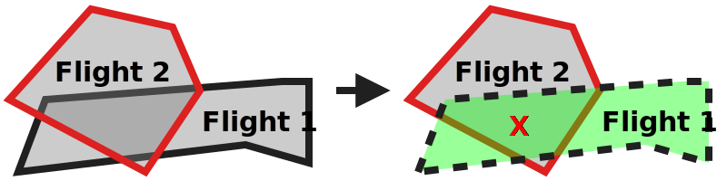

# Nominal planning: conflict with higher priority test scenario

## Description
This test aims to test the strategic coordination requirements that relate to the prioritization scenarios where there
exists a conflict with a higher priority flight:
- **[astm.f3548.v21.SCD0015](../../../../../requirements/astm/f3548/v21.md)**
- **[astm.f3548.v21.SCD0020](../../../../../requirements/astm/f3548/v21.md)**
- **[astm.f3548.v21.SCD0025](../../../../../requirements/astm/f3548/v21.md)**
- **[astm.f3548.v21.SCD0030](../../../../../requirements/astm/f3548/v21.md)**

It involves a tested USS and a control USS through which conflicting flights are injected.

## Resources
### flight_intents
FlightIntentsResource that provides the following flight intents:

<table>
  <tr>
    <th>Flight intent ID</th>
    <th>Flight name</th>
    <th>Priority</th>
    <th>State</th><!-- TODO: Update with usage_state and uas_state when new flight planning API is adopted -->
    <th>Must conflict with</th>
    <th>Must not conflict with</th>
  </tr>
  <tr>
    <td><code>flight_1_planned_vol_A</code></td>
    <td rowspan="2">Flight 1</td>
    <td rowspan="5">Any</td>
    <td>Accepted</td>
    <td rowspan="2">Flight 2</td>
    <td rowspan="2">Flight 2m</td>
  </tr>
  <tr>
    <td><code>flight_1_activated_vol_A</code></td>
    <td>Activated</td>
  </tr>
  <tr>
    <td><code>flight_1_planned_vol_A_extended</code></td>
    <td rowspan="2">Flight 1m</td>
    <td>Accepted</td>
    <td rowspan="2">Flight 2</td>
    <td rowspan="2">N/A</td>
  </tr>
  <tr>
    <td><code>flight_1_activated_vol_A_extended</code></td>
    <td>Activated</td>
  </tr>
  <tr>
    <td><code>flight_1_activated_vol_B</code></td>
    <td>Flight 1c</td>
    <td>Activated</td>
    <td>Flight 2</td>
    <td>N/A</td>
  </tr>
  <tr>
    <td><code>flight_2_planned_vol_A</code></td>
    <td rowspan="2">Flight 2</td>
    <td rowspan="3">Higher than Flight 1*</td>
    <td>Accepted</td>
    <td rowspan="2">Flight 1</td>
    <td rowspan="2">N/A</td>
  </tr>
  <tr>
    <td><code>flight_2_activated_vol_A</code></td>
    <td>Activated</td>
  </tr>
  <tr>
    <td><code>flight_2_activated_vol_B</code></td>
    <td>Flight 2m</td>
    <td>Activated</td>
    <td>Flight 1c</td>
    <td>Flight 1</td>
</table>

Because the scenario involves activation of intents, all activated intents must be active during the execution of the
test scenario. Additionally, their end time  must leave sufficient time for the execution of the test scenario. For the
sake of simplicity, it is recommended to set the start and end times of all the intents to the same range.

### tested_uss
FlightPlannerResource that is under test and will manage flight 1.

### control_uss
FlightPlannerResource that will manage conflicting flight 2.

### dss
DSSInstanceResource that provides access to a DSS instance where flight creation/sharing can be verified.

## Setup test case

### Check for flight planning readiness test step
Both USSs are queried for their readiness to ensure this test can proceed.

#### Flight planning USS not ready check
If either USS does not respond appropriately to the endpoint queried to determine readiness, this check will fail and the USS will have failed to meet **[astm.f3548.v21.GEN0310](../../../../../requirements/astm/f3548/v21.md)** as the USS does not support the InterUSS implementation of that requirement.

### Area clearing test step
Both USSs are requested to remove all flights from the area under test.

#### Area cleared successfully check
**[interuss.automated_testing.flight_planning.ClearArea](../../../../../requirements/interuss/automated_testing/flight_planning.md)**

## Attempt to plan flight in conflict test case

### [Plan flight 2 test step](../../../../flight_planning/plan_flight_intent.md)
The higher priority flight should be successfully planned by the control USS.

### [Validate flight 2 sharing test step](../../validate_shared_operational_intent.md)

### [Attempt to plan flight 1 test step](../../../../flight_planning/plan_priority_conflict_flight_intent.md)
The test driver attempts to plan the flight 1 via the tested USS. However, it conflicts with flight 2, which is of
higher priority. As such it should be rejected per **[astm.f3548.v21.SCD0015](../../../../../requirements/astm/f3548/v21.md)**.

### [Validate flight 1 not shared test step](../../validate_not_shared_operational_intent.md)

### [Delete flight 2 test step](../../../../flight_planning/delete_flight_intent.md)

## Attempt to modify planned flight in conflict test case

### [Plan flight 1 test step](../../../../flight_planning/plan_flight_intent.md)
The first flight should be successfully planned by the tested USS.

### [Validate flight 1 sharing test step](../../validate_shared_operational_intent.md)

### [Plan flight 2 test step](../../../../flight_planning/plan_flight_intent.md)
The second flight should be successfully planned by the control USS.
It conflicts with flight 1, but it has higher priority.

### [Validate flight 2 sharing test step](../../validate_shared_operational_intent.md)

### [Attempt to modify planned flight 1 in conflict test step](../../../../flight_planning/modify_planned_priority_conflict_flight_intent.md)
The test driver attempts to modify flight 1 via the tested USS, which is planned.
However, it conflicts with flight 2, which is of higher priority and was planned in the meantime.
As such it should be rejected per **[astm.f3548.v21.SCD0020](../../../../../requirements/astm/f3548/v21.md)**.

### [Validate flight 1 not modified test step](../../validate_shared_operational_intent.md)
Because the modification attempt was invalid, either Flight 1 should not have been modified (because the USS kept the
original accepted request), or it should have been removed (because the USS rejected the replacement plan provided).

## Attempt to activate flight in conflict test case

### [Attempt to activate conflicting flight 1 test step](../../../../flight_planning/activate_priority_conflict_flight_intent.md)
The test driver attempts to activate flight 1, however, it conflicts with flight 2, which is also planned and of
higher priority. Note that flight 1 could be either planned or non-existent before this step.
As such it should be rejected per **[astm.f3548.v21.SCD0025](../../../../../requirements/astm/f3548/v21.md)**.

### [Validate flight 1 not activated test step](../../validate_shared_operational_intent.md)
Because the modification attempt was invalid, either Flight 1 should not have been modified (because the USS kept the
original accepted request), or it should have been removed (because the USS rejected the replacement plan provided).

## Modify activated flight with pre-existing conflict test case

### [Delete flight 2 test step](../../../../flight_planning/delete_flight_intent.md)

### [Activate flight 1 test step](../../../../flight_planning/activate_flight_intent.md)
The test driver activates flight 1, which should be done successfully given that it is now the highest-priority flight.
Note that flight 1 could be either planned or non-existent before this step. In the latter case, the flight will be
directly activated without being planned beforehand.

### [Validate flight 1 sharing test step](../../validate_shared_operational_intent.md)

### [Plan flight 2 test step](../../../../flight_planning/plan_flight_intent.md)
The second flight should be successfully planned by the control USS.

### [Validate flight 2 sharing test step](../../validate_shared_operational_intent.md)

### [Activate flight 2 test step](../../../../flight_planning/activate_flight_intent.md)
The test driver activates flight 2, which should be done successfully given that it is the highest-priority flight.

### [Validate flight 2 sharing test step](../../validate_shared_operational_intent.md)

### [Modify activated flight 1 in conflict with activated flight 2 test step](../../../../flight_planning/modify_activated_flight_intent.md)
Before execution of this step, flights 1 and 2 are activated and in conflict. Flight 2 is the highest-priority flight.
The test driver attempts to modify flight 1 in a way that still conflicts with flight 2.

The successful outcomes of the modification attempts:
1. Even though flight 2 is the highest-priority flight, because the conflict existed before the modification was
   initiated, an accepted modification is considered a success per **[astm.f3548.v21.SCD0030](../../../../../requirements/astm/f3548/v21.md)**.
2. Due to the conflict, the USS may decide to be more conservative and to not support the modification. This is
   considered a success as there is no positive requirement for the USS to accept the modification.

A rejected modification will indicate a low severity failure. Indeed, in some situations a rejection may not be strictly
speaking a failure to meet a requirement. This could be the case for example if the USS does not support directly update
of intents and instead delete the previous one and create a new one. Since we cannot distinguish between an actual
failure to meet the requirement and a reasonable behavior due to implementation limitations, we indicate a low severity
failure which won't actually fail the test.

In any case, whatever is the outcome of this step, there should not be any impact on the rest of the execution of the
scenario. An intent should exist (this is checked in the next step) and it should be either the previous or the modified
intent, both of which make no difference in the next steps.

### [Validate flight 1 sharing test step](../../validate_shared_operational_intent.md)
If the modification was accepted, flight 1 should have been modified.
If the modification was not supported, flight 1 should not have been modified.
If the modification was rejected, flight 1 should not have been modified and should still exist. If it does not exist,
it means that there is an active flight without an operational intent, which is a failure to meet **[interuss.automated_testing.flight_planning.FlightCoveredByOperationalIntent](../../../../../requirements/interuss/automated_testing/flight_planning.md)**.

## Attempt to modify activated flight in conflict test case

### [Modify activated flight 2 to not conflict with activated flight 1 test step](../../../../flight_planning/modify_planned_flight_intent.md)
The test driver modifies (activated) flight 2 with the control USS so that it is not anymore in conflict with (activated)
flight of test USS.
As flight 2 is of higher priority, this should succeed and leave flight 1 clear of conflict.

### [Validate flight 2 sharing test step](../../validate_shared_operational_intent.md)

### [Attempt to modify activated flight 1 in conflict test step](../../../../flight_planning/modify_activated_priority_conflict_flight_intent.md)
The test driver attempts to modify flight 1 so that it becomes in conflict with flight 2. Both flights are activated at that point.
However, because the conflict did not exist when the modification was initiated, it should be rejected
per **[astm.f3548.v21.SCD0030](../../../../../requirements/astm/f3548/v21.md)**.

### [Validate flight 1 not modified test step](../../validate_shared_operational_intent.md)
Because the modification attempt was invalid, either Flight 1 should not have been modified (because the USS kept the
original accepted request), or it should have been removed (because the USS rejected the replacement plan provided).

## Cleanup
### Successful flight deletion check
**[interuss.automated_testing.flight_planning.DeleteFlightSuccess](../../../../../requirements/interuss/automated_testing/flight_planning.md)**
