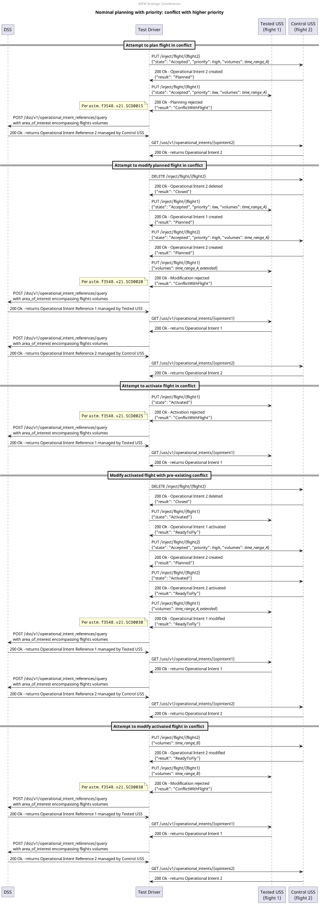

# Nominal planning with priority: conflict with higher priority test scenario

## Description
This test aims to test the strategic coordination requirements that relate to the prioritization scenarios where there
exists a conflict with a higher priority flight:
- **[astm.f3548.v21.SCD0015](../../../../requirements/astm/f3548/v21.md)**
- **[astm.f3548.v21.SCD0020](../../../../requirements/astm/f3548/v21.md)**
- **[astm.f3548.v21.SCD0025](../../../../requirements/astm/f3548/v21.md)**
- **[astm.f3548.v21.SCD0030](../../../../requirements/astm/f3548/v21.md)**

It involves a tested USS and a control USS through which conflicting flights are injected.

## Sequence

## Resources

### flight_intents
FlightIntentsResource that provides at least 3 flight intents:
- flights 1 and 2 must have volumes that conflict in time but not in space;
- flight 3 must have a volume that conflict in time and space with flight 2, and have a lower priority than flight 2;
- priorities of the flights must be: flight 1 = flight 3 = 20 < flight 2 = 30.

### tested_uss
FlightPlannerResource that is under test and will manage the first and third flights.

### control_uss
FlightPlannerResource that will be used to inject conflicting flight 2.

### dss
DSSInstanceResource that provides access to a DSS instance where flight creation/sharing can be verified.

## Setup test case

### Check for necessary capabilities test step
Both USSs are queried for their capabilities to ensure this test can proceed.

#### Valid responses check
If either USS does not respond appropriately to the endpoint queried to determine capability, this check will fail.

#### Support BasicStrategicConflictDetection check
This check will fail if the first flight planner does not support BasicStrategicConflictDetection per
**[astm.f3548.v21.GEN0310](../../../../requirements/astm/f3548/v21.md)** as the USS does not support the InterUSS
implementation of that requirement.  If the second flight planner does not support HighPriorityFlights, this scenario
will end normally at this point.

### Area clearing test step
Both USSs are requested to remove all flights from the area under test.

#### Area cleared successfully check
**[interuss.automated_testing.flight_planning.ClearArea](../../../../requirements/interuss/automated_testing/flight_planning.md)**

## Plan flight 1 via Tested USS test case
### [Plan flight 1 test step](../../../flight_planning/plan_flight_intent.md)
The first flight should be successfully planned by the tested USS.

### [Validate flight sharing test step](../validate_shared_operational_intent.md)

## Plan flight 2 via Control USS test case
### [Plan flight 2 test step](../../../flight_planning/plan_flight_intent.md)
The second flight should be successfully planned by the control USS.

### [Validate flight sharing test step](../validate_shared_operational_intent.md)

## Attempt to plan flight 3 via Tested USS, conflicting with higher-priority planned flight 2 test case
### [Plan conflicting flight 3 test step](../../../flight_planning/plan_priority_conflict_flight_intent.md)
The test driver attempts to plan the flight 3 via the tested USS. However, it conflicts with flight 2, which is of
higher priority. As such it should be rejected per **[astm.f3548.v21.SCD0015](../../../../requirements/astm/f3548/v21.md)**.

TODO: add validation test step that op intent was not created

## Attempt to move planned flight 1 onto volume of higher-priority planned flight 2 test case
### [Move conflicting flight 1 test step](../../../flight_planning/modify_planned_priority_conflict_flight_intent.md)
The test driver attempts to move flight 1 via the tested USS, which is planned.
However, it conflicts with flight 2, which is of higher priority and was planned in the meantime.
As such it should be rejected per **[astm.f3548.v21.SCD0020](../../../../requirements/astm/f3548/v21.md)**.

TODO: add validation test step that op intent was not modified

## Move higher-priority planned flight 2 onto volume of planned flight 1 test case
### [Move flight 2 test step](../../../flight_planning/modify_planned_flight_intent.md)
Flight 2, which is planned and of higher priority than flight 1, which is also planned, should be successfully moved
onto the volume of flight 1. The higher priority of flight 2 allows this modification resulting in a conflict.

### [Validate flight sharing test step](../validate_shared_operational_intent.md)

## Attempt to activate planned flight 1, conflicting with higher-priority planned flight 2 test case
### [Activate conflicting flight 1 test step](../../../flight_planning/activate_priority_conflict_flight_intent.md)
The test driver attempts to activate planned flight 1, however, it conflicts with flight 2, which is also planned and of
higher priority.
As such it should be rejected per **[astm.f3548.v21.SCD0025](../../../../requirements/astm/f3548/v21.md)**.

TODO: add validation test step that op intent was not activated

## Bump priority and activate flight 1 test case
### [Bump priority of flight 1 test step](../../../flight_planning/modify_planned_flight_intent.md)
The test driver bumps the priority of flight 1 (planned) above the one of flight 2 (planned as well), making flight 1
the higher-priority flight.

### [Activate flight 1 test step](../../../flight_planning/activate_flight_intent.md)
The test driver activates flight 1, which should be done successfully given that it is now the highest-priority flight.

### [Validate flight sharing test step](../validate_shared_operational_intent.md)

## Bump priority and activate flight 2 test case
### [Bump priority of flight 2 test step](../../../flight_planning/modify_planned_flight_intent.md)
The test driver bumps the priority of flight 2 (planned) above the one of flight 1 (planned as well), making flight 2
the highest-priority flight again.

### [Activate flight 2 test step](../../../flight_planning/activate_flight_intent.md)
The test driver activates flight 2, which should be done successfully given that it is now again the highest-priority
flight.

### [Validate flight sharing test step](../validate_shared_operational_intent.md)

## Slightly move activated flight 1, still conflicting with higher-priority activated flight 2 test case
### [Move flight 1 test step](../../../flight_planning/modify_activated_flight_intent.md)
The test driver moves flight 1 in a way that still conflicts with flight 2. Both flights are activated at that point.
Even though flight 2 is the highest-priority flight, because the conflict existed before the modification was initiated,
the modification is accepted per **[astm.f3548.v21.SCD0030](../../../../requirements/astm/f3548/v21.md)**.

### [Validate flight sharing test step](../validate_shared_operational_intent.md)

## Move away higher-priority activated flight 2 test case
### [Move flight 2 test step](../../../flight_planning/modify_planned_flight_intent.md)
The test driver moves flight 2 back to its original volume, which is not conflicting with flight 1.

## Attempt to move activated flight 1 onto volume of higher-priority activated flight 2 test case
### [Move conflicting flight 1 test step](../../../flight_planning/modify_planned_priority_conflict_flight_intent.md)
The test driver attempts to move flight 1 onto the volume of flight 2. Both flights are activated at that point.
However, this conflicts with higher-priority flight 2, and because the conflict did not exist when the modification was
initiated, it should be rejected per **[astm.f3548.v21.SCD0030](../../../../requirements/astm/f3548/v21.md)**.

TODO: add validation test step that op intent was not modified

## Cleanup
### Successful flight deletion check
**[interuss.automated_testing.flight_planning.DeleteFlightSuccess](../../../../requirements/interuss/automated_testing/flight_planning.md)**
