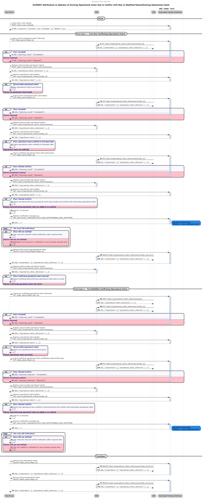

# Notifications to operator: conflict notification from nonconforming flight same USS test scenario

## Description
This test aims at testing the strategic conflict detection requirements that relate to the 
scenario where a conflict is created between an existing planned flight and a nonconforming flight 
from within the same USS and the existing flight is notified of the conflict:
- **[astm.f3548.v21.OPIN0025](../../../../requirements/astm/f3548/v21.md)**
- **[astm.f3548.v21.SCD0035](../../../../../requirements/astm/f3548/v21.md)**
- **[astm.f3548.v21.SCD0040](../../../../../requirements/astm/f3548/v21.md)**
- **[astm.f3548.v21.SCD0095](../../../../requirements/astm/f3548/v21.md)**
- **[astm.f3548.v21.USS0005](../../../../requirements/astm/f3548/v21.md)**

It involves a tested USS through which a control flight and conflicting flights are injected.

It assumes that the area used in the scenario is already clear of any pre-existing flights (using, for instance, PrepareFlightPlanners scenario).

## Sequence

## Resources
### flight_intents
The FlightIntentsResource must provide the following flight intents:

<table>
  <tr>
    <th>Flight intent ID</th>
    <th>Flight name</th>
    <th>Priority</th>
    <th>State</th><!-- TODO: Update with usage_state and uas_state when new flight planning API is adopted -->
    <th>Must conflict with</th>
    <th>Must not conflict with</th>
  </tr>
  <tr>
    <td><code>flight1_planned</code></td>
    <td>Flight 1</td>
    <td rowspan="3">Any</td>
    <td>Nonconforming</td>
    <td>Flight 2</td>
    <td>N/A</td>
  </tr>
  <tr>
    <td><code>flight1c_planned</code></td>
    <td>Flight 1c</td>
    <td>Accepted</td>
    <td>N/A</td>
    <td>Flight 2</td>
  </tr>
  <tr>
    <td><code>equal_prio_flight2_planned</code></td>
    <td>Flight 2</td>
    <td>Activated</td>
    <td>Flight 1</td>
    <td>Flight 1c</td>
  </tr>
</table>

Because the scenario involves activation of an intent and a nonconforming intent, 
all activated and nonconforming intents must be active during the execution of the test scenario. 
Additionally, their end time must leave sufficient time for the execution of the test scenario. 
For the sake of simplicity, it is recommended to set the start and end times of all the intents to the same range.

### tested_uss
FlightPlannerResource that is under test and be used to inject control Flight 2 and will manage conflicting Flight 1 and its variant. Note that this tested USS needs to support the CMSA role in order to transition a flight to the `Nonconforming` state in order to create a conflict.

### dss
DSSInstanceResource that provides access to a DSS instance where flight creation/sharing can be verified.

## Prerequisites check test case

### [Verify area is clear test step](../clear_area_validation.md)

While this scenario assumes that the area used is already clear of any pre-existing flights (using, for instance, PrepareFlightPlanners scenario) in order to avoid a large number of area-clearing operations, the scenario will not proceed correctly if the area was left in a dirty state following a previous scenario that was supposed to leave the area clear.  This test step verifies that the area is clear.

## Attempt to plan flight into conflict test case

### Plan Flight 2 test step

#### [Plan Flight 2](../../../flight_planning/plan_flight_intent.md)
Flight 2 should be successfully planned by the tested USS.

#### [Validate Flight 2 sharing](../validate_shared_operational_intent.md)

### Activate Flight 2 test step

#### [Activate Flight 2](../../../flight_planning/activate_flight_intent.md)
Flight 2 should be successfully activated by the tested USS.

#### [Validate Flight 2 sharing](../validate_shared_operational_intent.md)

### Create nonconforming Flight 1 test step
#### [Create nonconflorming Flight 1](test_steps/create_nonconforming_flight.md)
The test driver instructs the tested USS to create Flight 1 as nonconforming. This makes nonconforming Flight 1 conflict with activated Flight 2.

#### [Validate Flight 1 sharing](../validate_shared_operational_intent.md)

### [Delete Flight 1 test step](../../../flight_planning/delete_flight_intent.md)
To prepare for the next test case, Flight 1 must be removed from the system.

## Attempt to modify planned flight into conflict test case

### Plan Flight 1c test step

#### [Plan Flight 1c](../../../flight_planning/plan_flight_intent.md)
The smaller Flight 1c form (which doesn't conflict with Flight 2) should be successfully planned by the tested USS.

#### [Validate Flight 1c sharing](../validate_shared_operational_intent.md)

### Modify Flight 1c to Nonconforming state test step
#### [Modify Flight 1c to nonconforming](test_steps/modify_flight_to_nonconforming.md)
The test driver instructs the tested USS to modify Flight 1c into a larger Nonconforming state. This makes nonconforming Flight 1 conflict with activated Flight 2.

#### [Validate Flight 1 sharing](../validate_shared_operational_intent.md)

### Validate tested USS conflict notification to user

#### [Validate tested USS conflict notifications to user from attempted new planned flight](test_steps/validate_user_conflict_notification_from_other_flight.md)
The test driver waits 12 seconds and checks conflict notification logs of tested USS to verify that notification was sent to Flight 1 due to conflict with Flight 2 from case "Attempt to plan flight into conflict test case".

#### [Validate tested USS conflict notification to user from attempted modified flight](test_steps/validate_user_conflict_notification_from_other_flight.md)
The test driver also verifies that notification was sent to Flight 1c due to conflict with Flight 2 from case "Attempt to modify planned flight into conflict test case".

## Cleanup
### ⚠️ Successful flight deletion check
**[interuss.automated_testing.flight_planning.DeleteFlightSuccess](../../../../requirements/interuss/automated_testing/flight_planning.md)**
