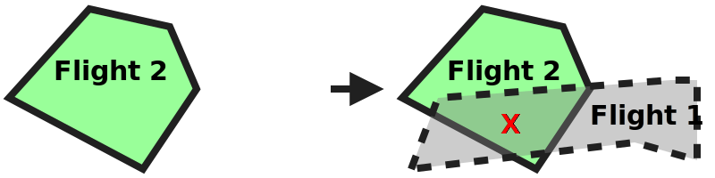

# Nominal planning: not permitted conflict with equal priority test scenario

## Description
This test aims at testing the strategic coordination requirements that relate to the scenarios where
a conflict is created between an existing planned flight and a nonconforming flight:
- **[astm.f3548.v21.OPIN0025](../../../../requirements/astm/f3548/v21.md)**
- **[astm.f3548.v21.SCD0035](../../../../requirements/astm/f3548/v21.md)**
- **[astm.f3548.v21.SCD0090](../../../../requirements/astm/f3548/v21.md)**
- **[astm.f3548.v21.USS0005](../../../../requirements/astm/f3548/v21.md)**

It involves a control USS and a tested USS through which conflicting nonconforming flights are injected.

It assumes that the area used in the scenario is already clear of any pre-existing flights (using, for instance, PrepareFlightPlanners scenario).

## Sequence

## Resources
### flight_intents
The FlightIntentsResource must provide the following flight intents:

<table>
  <tr>
    <th>Flight intent ID</th>
    <th>Flight name</th>
    <th>Priority</th>
    <th>State</th><!-- TODO: Update with usage_state and uas_state when new flight planning API is adopted -->
    <th>Must conflict with</th>
    <th>Must not conflict with</th>
  </tr>
  <tr>
    <td><code>nonconforming_flight1_planned</code></td>
    <td>Flight 1</td>
    <td rowspan="3">Any</td>
    <td>Planned</td>
    <td>Flight 2</td>
    <td>N/A</td>
  </tr>
  <tr>
    <td><code>flight1c_planned</code></td>
    <td>Flight 1c</td>
    <td rowspan="2">Accepted</td>
    <td>N/A</td>
    <td>Flight 2</td>
  </tr>
  <tr>
    <td><code>flight2_planned</code></td>
    <td>Flight 2</td>
    <td>Flight 1</td>
    <td>Flight 1c</td>
  </tr>
</table>

Because the scenario involves nonconforming intents, all nonconforming intents must be active during the execution of the
test scenario. Additionally, their end time must leave sufficient time for the execution of the test scenario. For the
sake of simplicity, it is recommended to set the start and end times of all the intents to the same range.

### tested_uss
FlightPlannerResource that is under test and will manage conflicting Flight 1 and its variant. Note that this tested USS needs to support the
CMSA role in order to transition to the `Nonconforming` state in order to create a conflict regardless of priority status.

### control_uss
FlightPlannerResource that will be used to inject control Flight 2. 

### dss
DSSInstanceResource that provides access to a DSS instance where flight creation/sharing can be verified.

## Prerequisites check test case

### [Verify area is clear test step](../clear_area_validation.md)

While this scenario assumes that the area used is already clear of any pre-existing flights (using, for instance, PrepareFlightPlanners scenario) in order to avoid a large number of area-clearing operations, the scenario will not proceed correctly if the area was left in a dirty state following a previous scenario that was supposed to leave the area clear.  This test step verifies that the area is clear.

## Attempt to create new nonconforming flight into conflict test case

### Plan Flight 2 test step

#### [Plan Flight 2](../../../flight_planning/plan_flight_intent.md)
Flight 2 should be successfully planned by the control USS.

#### [Validate Flight 2 sharing](../validate_shared_operational_intent.md)

### Create nonconforming Flight 1 test step
#### [Create nonconforming Flight 1](test_steps/create_nonconforming_flight.md)
The test driver instructs the tested USS to create Flight 1 as nonconforming. This makes nonconforming Flight 1 conflict with planned Flight 2.

#### [Validate Flight 1 sharing](../validate_shared_operational_intent.md)
Flight 1 should be successfully logged in the DSS and available to be shared.

### [Delete Flight 1 test step](../../../flight_planning/delete_flight_intent.md)
To prepare for the next test case, Flight 1 must be removed from the system.

## Attempt to modify planned flight into nonconforming conflict test case

### Plan Flight 1c test step

#### [Plan Flight 1c](../../../flight_planning/plan_flight_intent.md)
The smaller Flight 1c form (which doesn't conflict with Flight 2) should be successfully planned by the tested USS.

#### [Validate Flight 1c sharing](../validate_shared_operational_intent.md)

### Modify Flight 1 to nonconforming state test step
#### [Modify Flight 1c to nonconforming.](test_steps/modify_flight_to_nonconforming.md)
The test driver instructs the tested USS to modify Flight 1c into a larger Nonconforming state. This makes nonconforming Flight 1 conflict with planned Flight 2.

#### [Validate Flight 1 sharing](../validate_shared_operational_intent.md)
Flight 1 should be successfully logged in the DSS and available to be shared.

### Validate tested USS conflict notifications to user test step

Wait a minimum of 15 seconds before continuing to give system time to process messages. 

#### [Validate tested USS conflict notification to user for new flight](test_steps/validate_user_conflict_notification_with_another_flight.md)
The test driver checks conflict notification logs of tested USS to verify that notification was sent to Flight 1 due to conflict with Flight 2 from case "Attempt to create new nonconforming flight into conflict test case".

#### [Validate tested USS conflict notification to user for modified flight](test_steps/validate_user_conflict_notification_with_another_flight.md)
The test driver also checks conflict notification logs of tested USS to verify that notification was sent to Flight 1 due to conflict with Flight 2 from case "Attempt to modify planned flight into nonconforming conflict test case".

## Cleanup
#### [Clear flights from control USS and tested USS](test_steps/clear_flights.md)

The test driver clears flights from control USS and tested USS.