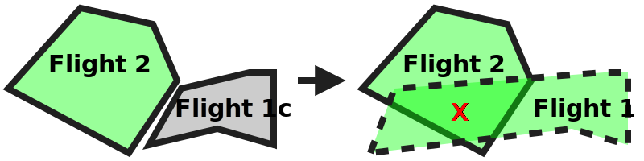

# Notifications to operator: internal equal priority conflict not permitted test scenario

## Description
This test aims at testing the strategic coordination requirements that relate to the notification scenarios where
a new or modified operational intent creates a conflict with an existing operational intent within the same USS and the operator of that operational intent is notified. It conforms to the following regulations:
- **[astm.f3548.v21.OPIN0025](../../../../requirements/astm/f3548/v21.md)**
- **[astm.f3548.v21.SCD0035](../../../../../requirements/astm/f3548/v21.md)**
- **[astm.f3548.v21.SCD0040](../../../../../requirements/astm/f3548/v21.md)**
- **[astm.f3548.v21.SCD0095](../../../../requirements/astm/f3548/v21.md)**
- **[astm.f3548.v21.USS0005](../../../../requirements/astm/f3548/v21.md)**

It involves a tested USS through which a control flight and conflicting flights are injected.

This scenario skips execution and completes successfully at the setup case if a resource containing equal priority flight intents where conflicts are not allow is not provided, such as if a jurisdiction does not have any priority levels at which conflicts are not allowed.

It assumes that the area used in the scenario is already clear of any pre-existing flights (using, for instance, PrepareFlightPlanners scenario).

## Resources
### flight_intents
If the jurisdiction in which these tests are being conducted does not have a priority level at which conflicts are not allowed, the FlightIntentsResource must be None to prevent the
execution of this test.

Otherwise, the FlightIntentsResource must provide the following flight intents:

<table>
  <tr>
    <th>Flight intent ID</th>
    <th>Flight name</th>
    <th>Priority</th>
    <th>State</th><!-- TODO: Update with usage_state and uas_state when new flight planning API is adopted -->
    <th>Must conflict with</th>
    <th>Must not conflict with</th>
  </tr>
  <tr>
    <td><code>flight1_planned</code></td>
    <td>Flight 1</td>
    <td rowspan="3">Any (but all the same)</td>
    <td>Planned</td>
    <td>Flight 2</td>
    <td>N/A</td>
  </tr>
  <tr>
    <td><code>flight1c_planned</code></td>
    <td>Flight 1c</td>
    <td rowspan="2">Accepted</td>
    <td>N/A</td>
    <td>Flight 2</td>
  </tr>
  <tr>
    <td><code>equal_prio_flight2_planned</code></td>
    <td>Flight 2</td>
    <td>Flight 1</td>
    <td>Flight 1c</td>
  </tr>
</table>

Because the scenario involves injection of intents, all accepted intents must be discoverable during the execution of the
test scenario. Additionally, their end time must leave sufficient time for the execution of the test scenario. For the
sake of simplicity, it is recommended to set the start and end times of all the intents to the same range.

### tested_uss
FlightPlannerResource that is under test and be used to inject conflicting Flight 2 and will manage Flight 1 and its variants.

### dss
DSSInstanceResource that provides access to a DSS instance where flight creation/sharing can be verified.

## Prerequisites check test case

### [Verify area is clear test step](../clear_area_validation.md)

While this scenario assumes that the area used is already clear of any pre-existing flights (using, for instance, PrepareFlightPlanners scenario) in order to avoid a large number of area-clearing operations, the scenario will not proceed correctly if the area was left in a dirty state following a previous scenario that was supposed to leave the area clear.  This test step verifies that the area is clear.

## Attempt to plan flight into conflict test case

### Plan Flight 2 test step

#### [Plan Flight 2](../../../flight_planning/plan_flight_intent.md)
Flight 2 should be successfully planned by the tested USS.

#### [Validate Flight 2 sharing](../validate_shared_operational_intent.md)

### Attempt to plan Flight 1 test step

#### [Attempt to plan Flight 1](../../../flight_planning/plan_conflict_flight_intent.md)
The test driver attempts to plan the Flight 1 via the tested USS. However, it conflicts with Flight 2
which is of equal priority but came first. As such it should be rejected
per **[astm.f3548.v21.SCD0035](../../../../requirements/astm/f3548/v21.md)**.

#### [Validate Flight 1 not shared](../validate_not_shared_operational_intent.md)
Flight 1 should not have been shared with the interoperability ecosystem since it was rejected.

## Attempt to modify planned flight into conflict test case

### Plan Flight 1c test step

#### [Plan Flight 1c](../../../flight_planning/plan_flight_intent.md)
The smaller Flight 1c form (which doesn't conflict with Flight 2) should be successfully planned by the tested USS.

#### [Validate Flight 1c sharing](../validate_shared_operational_intent.md)

### Attempt to modify planned Flight 1c into conflict test step

#### [Attempt to modify Flight 1c](../../../flight_planning/modify_planned_conflict_flight_intent.md)
The test driver attempts to enlarge Flight 1c so that it conflicts with Flight 2.
However, Flight 2 is of equal priority but was planned first.
As such the change to Flight 1c should be rejected per **[astm.f3548.v21.SCD0040](../../../../requirements/astm/f3548/v21.md)**.

#### [Validate Flight 1c not modified](../validate_shared_operational_intent.md)
Because the modification attempt was invalid, either Flight 1c should not have been modified (because the USS kept the
original accepted request), or it should have been removed (because the USS rejected the replacement plan provided).

### Validate tested USS conflict notification to user

#### [Validate tested USS conflict notifications to user from attempted new planned flight](test_steps/validate_user_conflict_notification_from_other_flight.md)
The test driver waits 12 seconds and checks conflict notification logs of tested USS to verify that notification was sent to Flight 1 due to conflict with Flight 2 from case "Attempt to plan flight into conflict test case".

#### [Validate tested USS conflict notification to user from attempted modified flight](test_steps/validate_user_conflict_notification_from_other_flight.md)
The test driver also verifies that notification was sent to Flight 1c due to conflict with Flight 2 from case "Attempt to modify planned flight into conflict test case".

## Cleanup
### ⚠️ Successful flight deletion check
**[interuss.automated_testing.flight_planning.DeleteFlightSuccess](../../../../requirements/interuss/automated_testing/flight_planning.md)**
