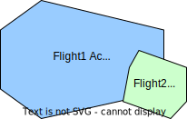

# USS Awareness of Relevant Operational Intent Changes When Managing Operational Intents test scenario

## Description
When a USS submits an operational intent to DSS, a subscription is associated with that operational intent in DSS.
This subscription can be either an implicit or explicit subscription that covers the area of the operational intent.
The subscription helps the USS to be notified of new or modified operations in the area, when its operational intent is in
Activated, NonConforming and Contingent state. In this scenario, we will verify that USS under test has a subscription
to cover the operational intent area, and receives relevant notifications from other USSes.

- **[astm.f3548.v21.SCD0080](../../../../../requirements/astm/f3548/v21.md)**

This scenario assumes that the area used in the scenario is already clear of any pre-existing flights (using, for instance, PrepareFlightPlanners scenario).

## Resources
### flight_intents
FlightIntentsResource provides flight_1_* variations with modification to extend its area and state.
It also provides flight_2_* variations that do not intersect with flight_1_* , but their convex hulls intersect.
There is an overlap of time and altitude of flight_1_* with flight_2_* .
This makes the associated flights relevant to each other.
flight_2* is modified in area or time range to trigger notifications.
flight_2_area2 intersects with flight_1_extended_area_activated.
There is an overlap of time and altitude of flight_2* with flight_1_*.

<table>
<tr> <th>Flight Intent Id</th>	<th>Flight name in doc</th>  <th> State </th>	<th> Must be relevant, but not intersecting </th></tr>

<tr> <td>flight_1_planned</td>	<td>flight1</td>  <td> Accepted </td>	<td> - </td></tr>
<tr> <td>flight_1_activated</td>	<td>flight1</td>  <td> Activated </td>	<td> flight_2 </td></tr>
<tr> <td>flight_1_extended_area_activated</td>	<td>flight1m</td>  <td> Activated </td>	<td> flight_2_area2 </td></tr>
<tr> <td>flight_1_nc</td>	<td>flight1</td>  <td> NonConforming </td>	<td> flight_2_time_range_b </td></tr>
<tr> <td>flight_1_contingent</td>	<td>flight1</td>  <td> Contingent </td>	<td> flight_2_time_range_c </td></tr>
<tr> <td>flight_2</td>	<td>flight2</td>  <td> Accepted </td>	<td> flight_1_* </td></tr>
<tr> <td>flight_2_area2</td>	<td>flight2m</td>  <td> Accepted </td>	<td> flight_1_extended_area_* </td></tr>
<tr> <td>flight_2_time_range_*</td>	<td>flight2m</td>  <td> Accepted </td>	<td> flight_1_* </td></tr>

</table>

### mock_uss
MockUSSResource will be used for planning flights in order to send notifications to tested_uss, and gathering interuss interactions from mock_uss.

### tested_uss
FlightPlannerResource that will be used for the USS being tested for its ability to maintain awareness of operational intent.

### dss
DSSInstanceResource that provides access to a DSS instance where flight creation/sharing can be verified.

## Activated operational intent receives notification of relevant intent test case

This test case verifies that relevant notifications are received through subscription of an operational intent in Activated state.

### Tested_uss plans flight1 test step

#### [Plan flight1](../../../../flight_planning/plan_flight_intent.md)
flight1 should be successfully planned by the control USS.

#### [Validate flight1 sharing](../../validate_shared_operational_intent.md)

### Activate flight1 test step

#### [Activate flight1](../../../../flight_planning/activate_flight_intent.md)
flight1 should be successfully activated by the tested USS.

#### [Validate flight1 sharing](../../validate_shared_operational_intent.md)

#### Retrieve the subscription id for flight1 test step fragment
A subscription would be associated with flight1 in DSS.
Notifications will be sent to tested_uss using the subscription id of this subscription.
While checking notifications received by tested_uss, we can verify if the notification used this subscription id.

### Mock_uss plans flight2 test step

#### [Plan flight2](../../../../flight_planning/plan_flight_intent.md)
The test driver successfully plans flight2 via the mock uss, as there is no conflict with flight1.
However, because they are relevant to each other mock_uss will send flight2 notification to tested_uss.

#### [Validate flight2 sharing](../../validate_shared_operational_intent.md)

### [Validate flight2 notification received by tested_uss test step](../test_steps/validate_notification_received.md)
Check a notification was sent by mock_uss to tested_uss for flight2, with flight1's subscription_id.

## Modify Activated operational intent area and receive notification of relevant intent test case

### ToDo

## Declare Operational intent non-conforming and receive notification of relevant intent test case

### ToDo

## Declare Operational intent contingent and receive notification of relevant intent test case

### ToDo

## Cleanup
### Successful flight deletion check
This cleanup is for both - after testcase ends and after test scenario ends
**[interuss.automated_testing.flight_planning.DeleteFlightSuccess](../../../../../requirements/interuss/automated_testing/flight_planning.md)**
