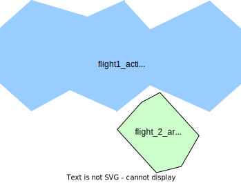
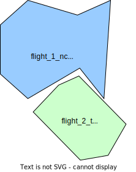

# USS Awareness of Relevant Operational Intent Changes When Managing Operational Intents test scenario

## Description
When a USS under test submits an operational intent to DSS, a subscription is associated with that operational intent in DSS.
This subscription can be either an implicit or explicit subscription that covers the area of the operational intent.
The subscription helps the USS to be notified of new or modified operations in the area, when its operational intent is in
Activated, NonConforming and Contingent state. In this scenario, we will verify that USS under test has a subscription
to cover the operational intent area, and receives relevant notifications from other USSes.

- **[astm.f3548.v21.SCD0080](../../../../../requirements/astm/f3548/v21.md)**

This scenario assumes that the area used in the scenario is already clear of any pre-existing flights (using, for instance, PrepareFlightPlanners scenario).

## Resources
### flight_intents
FlightIntentsResource provides flight_1 variations with modification to extend its area and state, with lower priority 0.
flight_2 variations intersects with all flight_1_* variations. flight_2 modified in time range to trigger notifications.
flight_2_m intersects with flight_1_extended_* variations.
There is an overlap of time and altitude of flight_2* with flight_1_*.
flight_2 variations have a higher priority than flight_1 variations, which allows flight2 to be planned despite conflict.

- flight_1_planned
- flight_1_activated
- flight_1_extended_area_activated
- flight_1_non_conforming
- flight_1_contingent
- flight_2
- flight_2_area2
- flight_2_time_range_b
- flight_2_time_range_c

<table>
<tr> <th>Flight Intent Id</th>	<th>Flight name in doc</th>  <th>	Priority </th>	<th> State </th>	<th> Any conflict </th></tr>

<tr> <td>flight_1_planned</td>	<td>flight1</td>  <td>	0 </td>	<td> Accepted </td>	<td> - </td></tr>
<tr> <td>flight_1_activated</td>	<td>flight1</td>  <td>	0 </td>	<td> Activated </td>	<td> flight_2 </td></tr>
<tr> <td>flight_1_extended_area_activated</td>	<td>flight1m</td>  <td>	0 </td>	<td> Activated </td>	<td> flight_2_diff_area </td></tr>
<tr> <td>flight_1_extended_area_non_conforming</td>	<td>flight1m</td>  <td>	0 </td>	<td> NonConforming </td>	<td> flight_2_time_range_b </td></tr>
<tr> <td>flight_1_extended_area_contingent</td>	<td>flight1m</td>  <td>	0 </td>	<td> Contingent </td>	<td> flight_2_time_range_c </td></tr>
<tr> <td>flight_2</td>	<td>flight2</td>  <td>	10 </td>	<td> Accepted </td>	<td> flight_1* </td></tr>
<tr> <td>flight_2_time_range_*</td>	<td>flight2</td>  <td>	10 </td>	<td> Accepted </td>	<td> flight_1* </td></tr>
<tr> <td>flight_2_diff_area</td>	<td>flight2m</td>  <td>	10 </td>	<td> Accepted </td>	<td> flight_1_extended_* </td></tr>

</table>

### mock_uss
MockUSSResource will be used for planning flights in order to send notifications to tested_uss, and gathering interuss interactions from mock_uss.

### tested_uss
FlightPlannerResource that will be used for the USS being tested for its ability to maintain awareness of operational intent.

### dss
DSSInstanceResource that provides access to a DSS instance where flight creation/sharing can be verified.

===================================================================
## Activate operational intent and receive notification of relevant intent test case

This test case verifies that relevant notifications are received through subscription of an operational intent in Activated state.

### Tested_uss plans flight_1 test step

#### [Plan flight_1](../../../../flight_planning/plan_flight_intent.md)
Flight 2 should be successfully planned by the control USS.

#### [Validate flight_1 sharing](../../validate_shared_operational_intent.md)

### Activate flight_1 test step

#### [Activate flight_1](../../../../flight_planning/activate_flight_intent.md)
Flight_1 should be successfully activated by the tested USS.

#### Retrieve the subscription id for flight_1
A subscription would be associated with flight_1 in DSS.
Notifications will sent to tested_uss using the subscription id of this subscription,
which we can use to verify while checking notifications received by tested_uss.

#### [Validate flight1 sharing](../../validate_shared_operational_intent.md)

### Mock_uss plans flight2 test step

#### [Plan flight2](../../../../flight_planning/plan_flight_intent.md)
The test driver successfully plans flight2 via the mock uss, as it has higher priority than flight 2.
This leads to notification of flight 2 sent to tested_uss.

#### [Validate flight2 sharing](../../validate_shared_operational_intent.md)

### [Validate flight2 notification received by tested_uss test step](../test_steps/validate_notification_received.md)
mock_uss notifies about flight2 to tested_uss, using subscription id associated with flight1.

===================================================================

## Modify Activated operational intent area and receive notification of relevant intent test case

This test case verifies the subscription covers the extended area
after the flight modification, and relevant notifications in the
extended area are received as well.
### Modify activated flight1 test step

#### [Modify flight1](../../../../flight_planning/modify_activated_flight_intent.md)
Flight1 should be successfully modified with its area extended by the tested_uss, using flight_1_extended_area_activated.
This modification will require the subscription in DSS to also include this extended area.
Referring this modified flight1 as flight1m.

#### [Validate flight1m sharing](../../validate_shared_operational_intent.md)

#### Retrieve the subscription id for flight1m
Relevant notifications will sent to tested_uss using this subscription id.

### Modify flight2 area test step

#### [Modify flight2 area](../../../../flight_planning/plan_flight_intent.md)

The test driver modifies to flight2 via the mock uss, using flight_2_area2.
This intent intersects the extended part of flight1m.
Referring modified flight2 as flight2m.

#### [Validate flight2m sharing](../../validate_shared_operational_intent.md)

### [Validate flight2m notification received by tested_uss test step](../test_steps/validate_notification_received.md)
Check notification was sent by mock_uss about flight2m to tested_uss with flight1m subscription id.

===================================================================

## Declare Operational intent non-conforming and receive notification of relevant intent test case

This test case verifies that relevant notifications are received through subscription of an operational intent in NonConforming state.

### Declare flight1m non-conforming test step
The test driver instructs the tested USS to declare flight1m as non-conforming, using flight_1_non_conforming.

Do note that executing this test step requires the control USS to support the CMSA role. As such, if the USS rejects the
transition to non-conforming state, it will be assumed that the control USS does not support this role and the test
execution will stop without failing.

#### ℹ️ Successful transition to non-conforming state check
All flight intent data provided is correct, therefore it should have been
transitioned to non-conforming state by the USS
per **[interuss.automated_testing.flight_planning.ExpectedBehavior](../../../../../requirements/interuss/automated_testing/flight_planning.md)**.
If the USS indicates a conflict, this check will fail. If the USS indicates that the injection attempt failed, this check will fail.

#### Retrieve the subscription id for flight1m
Relevant notifications will sent to tested_uss using this subscription id.

### Modify flight2 test step

#### [Modify flight2](../../../../flight_planning/modify_planned_flight_intent.md)
The test driver modifies flight2 time range via the mock uss, using flight_2_time_range_b.
This leads to notification sent to tested_uss.

#### [Validate flight2 sharing](../../validate_shared_operational_intent.md)

### [Validate flight2 notification received by tested_uss test step](../test_steps/validate_notification_received.md)
Check notification was sent by mock_uss about flight2 to tested_uss with flight1m subscription id.

===================================================================

## Declare Operational intent contingent and receive notification of relevant intent test case

This test case verifies that relevant notifications are received through subscription of an operational intent in Contingent state.

### Declare Flight1 contingent test step
The test driver instructs the tested USS to declare Flight 1 as contingent, using flight_1_contingent.

Do note that executing this test step requires the control USS to support the CMSA role. As such, if the USS rejects the
transition to contingent state, it will be assumed that the control USS does not support this role and the test
execution will stop without failing.

#### ℹ️ Successful transition to contingent state check
All flight intent data provided is correct, therefore it should have been
transitioned to contingent state by the USS
per **[interuss.automated_testing.flight_planning.ExpectedBehavior](../../../../../requirements/interuss/automated_testing/flight_planning.md)**.
If the USS indicates a conflict, this check will fail. If the USS indicates that the injection attempt failed, this check will fail.

#### Find the subscription id for flight1

### mock_uss modifies flight2 test step

#### [Modify flight2](../../../../flight_planning/modify_planned_flight_intent.md)
The test driver modifies flight2 time range via the mock uss, using flight_2_time_range_c.
This leads to notification sent to tested_uss.

#### [Validate flight2 sharing](../../validate_shared_operational_intent.md)

### [Validate flight2 notification received by tested_uss test step](../test_steps/validate_notification_received.md)
Check notification was sent by mock_uss about flight2 to tested_uss with flight1m subscription id.

===================================================================

## Cleanup
### Successful flight deletion check
This cleanup is for both - after testcase ends and after test scenario ends
**[interuss.automated_testing.flight_planning.DeleteFlightSuccess](../../../../../requirements/interuss/automated_testing/flight_planning.md)**
