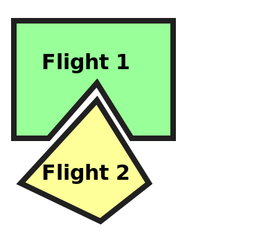

# Awareness of relevant operational intents test scenario

## Description

When a USS submits an operational intent to DSS, a subscription is associated with that operational intent in DSS.
This subscription can be either an implicit or explicit subscription that covers the area of the operational intent.
The subscription helps the USS to be notified of new or modified operations in the area, when its operational intent is in
Activated, NonConforming and Contingent states. In this scenario, we will verify that USS under test has a subscription
to cover the operational intent area, and receives relevant notifications from other USSes.

- **[astm.f3548.v21.SCD0080](../../../../../requirements/astm/f3548/v21.md)**

This scenario assumes that the area used in the scenario is already clear of any pre-existing flights (using, for instance, PrepareFlightPlanners scenario).

## Resources

### flight_intents

FlightIntentsResource that provides the following flight intents:

<table>
    <tr>
        <th>Flight intent ID</th>
        <th>Flight name</th>
        <th>State</th><!-- TODO: Update with usage_state and uas_state when new flight planning API is adopted -->
        <th>Must be relevant, but not intersecting</th>
    </tr>
    <tr>
        <td><code>flight_1_planned</code></td>
        <td rowspan="2">Flight 1</td>
        <td>Accepted</td>
        <td rowspan="2">Flight 2</td>
    </tr>
    <tr>
        <td><code>flight_1_activated</code></td>
        <td>Activated</td>
    </tr>
    <tr>
        <td><code>flight_2_planned</code></td>
        <td>Flight 2</td>
        <td>Accepted</td>
        <td>Flight 1</td>
    </tr>
</table>

To reach a situation where Flight 1 and Flight 2 do not intersect but are relevant to each other:
- their time ranges and altitudes do intersect;
- their geometries do not intersect, but their convex hulls do.

Because the scenario involves activation of intents, all activated intents must be active during the execution of the test scenario. Additionally, their end time must leave sufficient time for the execution of the test scenario. For the sake of simplicity, it is recommended to set the start and end times of all the intents to the same range.

### mock_uss

MockUSSResource will be used for planning flights in order to send notifications to tested_uss, and gathering interuss interactions from mock_uss.

### tested_uss

FlightPlannerResource that will be used for the USS being tested for its ability to maintain awareness of operational intent.

### dss

DSSInstanceResource that provides access to a DSS instance where flight creation/sharing can be verified.

## Activated operational intent receives notification of relevant intent test case

This test case verifies that relevant notifications are received through subscription of an operational intent in Activated state.

### Tested_uss plans and activates Flight 1 test step

#### [Plan Flight 1](../../../../flight_planning/plan_flight_intent.md)

Flight 1 should be successfully planned by tested_uss.

#### [Validate Flight 1 sharing](../../validate_shared_operational_intent.md)

#### [Activate Flight 1](../../../../flight_planning/activate_flight_intent.md)

Flight 1 should be successfully activated by the tested USS.

#### [Validate Flight 1 sharing](../../validate_shared_operational_intent.md)

While validating that Flight 1 has been shared, we will be able to find the  subscription id associated with Flight 1 in DSS.
Notifications of relevant flights will be sent to tested_uss using this subscription id.

### Mock_uss plans Flight 2 test step

#### [Plan Flight 2](../../../../flight_planning/plan_flight_intent.md)

The test driver successfully plans Flight 2 via the mock uss, as there is no conflict with Flight 1.
However, because they are relevant to each other mock_uss will send Flight 2 notification to tested_uss.

#### [Validate Flight 2 sharing](../../validate_shared_operational_intent.md)

### [Validate Flight 2 notification received by tested_uss test step](../test_steps/validate_notification_received.md)

Check a notification was received by tested_uss for Flight 2, with Flight 1's subscription_id.

## Modify Activated operational intent area and receive notification of relevant intent test case

### ToDo

## Declare Operational intent non-conforming and receive notification of relevant intent test case

### ToDo

## Declare Operational intent contingent and receive notification of relevant intent test case

### ToDo

## Cleanup

### Successful flight deletion check

This flights are cleaned up at the end of the test scenario.
**[interuss.automated_testing.flight_planning.DeleteFlightSuccess](../../../../../requirements/interuss/automated_testing/flight_planning.md)**
