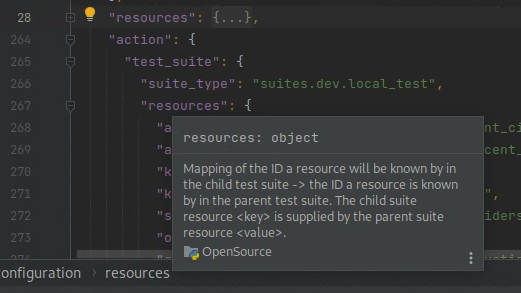

# JSON Schemas

## Contents

This folder containers JSON Schemas for relevant data types (ImplicitDict subclasses) in the `monitoring` repository, and the tools for managing these schemas.

## Usage

[JSON Schemas](https://json-schema.org) describe validation criteria for JSON objects and can be used to infer the structure of the objects themselves.  If a viewer knows the type of JSON object they are examining, many tools allow the specification of the JSON Schema for that object type to perform validation and provide contextual information.  For uss_qualifier, the most common data formats .json file artifacts will use are [monitoring.uss_qualifier.configurations.configuration.USSQualifierConfiguration](monitoring/uss_qualifier/configurations/configuration/USSQualifierConfiguration.json) for uss_qualifier configuration inputs and [monitoring.uss_qualifier.reports.report.TestRunReport](monitoring/uss_qualifier/reports/report/TestRunReport.json) for the primary uss_qualifier output.

### IntelliJ

IntelliJ CE (and likely other versions) allow users to assign a JSON Schema to a particular JSON file they are viewing in IntelliJ in order to provide context hints and validation.  To do this:

1. Open the JSON or YAML file of interest (not the JSON Schema file) and look near the lower right corner of the IDE
2. Find and click on the text "No JSON Schema"
3. Click "+ New Schema Mapping..."
4. Click the folder icon to select the "Schema file or URL", then find the JSON Schema file in a descendant folder from this folder
5. Select version 7 as the Schema version (even though this is not quite right)
6. Click Ok

Now, IntelliJ should provide context hints and validation for that file.  Once this is done once, additional JSON files of the same type can be associated with that schema by performing steps 1 & 2, then selecting the appropriate schema under "Registered Schemas" instead of proceeding to step 3.

## Generation and updates

All schemas are auto-generated and should not be changed manually.  Running `make format` from the root of the repository will ensure that all schemas are in sync with the canonical code definitions.  Running `make format` in this folder will only perform that action (and not other autoformatting actions outside this folder).

Note that if `make format` generates new .json JSON Schema files (if a new ImplicitDict class is defined in the codebase), these files will be created on the development machine with the owner set to the user under which the docker engine is running -- this is often root.  In this situation, it will generally be desirable to change ownership of these files back to the normal user of the development machine.  In Posix environments (Mac and Linux), this can be performed by executing this command from the root of the repo: `sudo chown -R $USER:$(id -gn) schemas`
